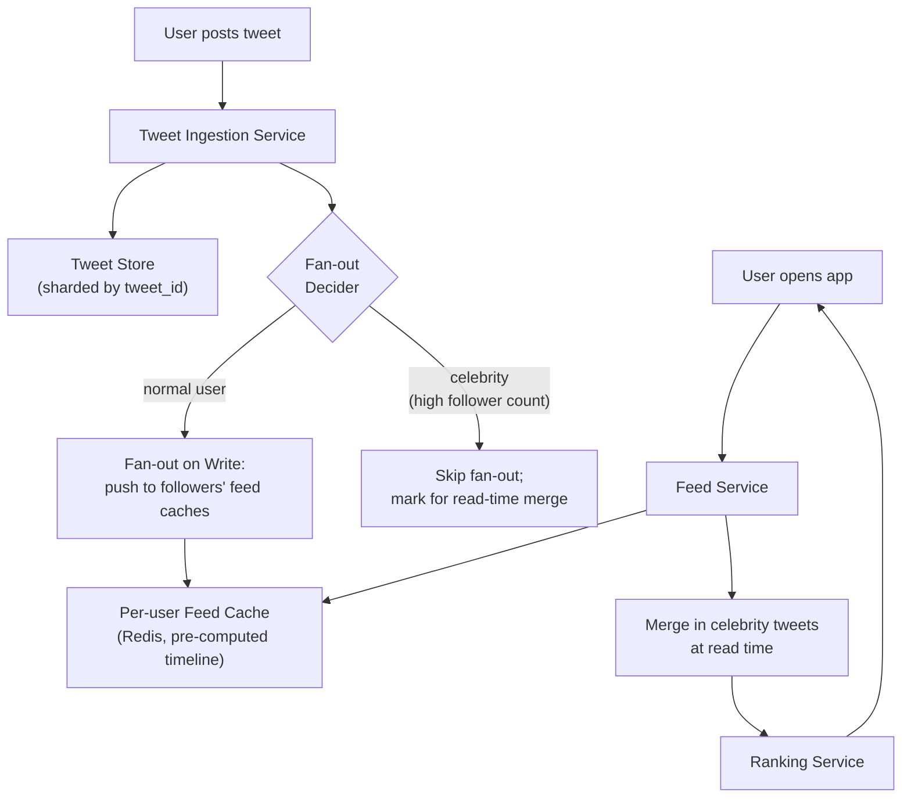

# Design Twitter/X Feed

**Primarily tests**: fan-out strategy trade-offs, the celebrity/hot-key problem, and feed
ranking. One of the most commonly asked system design problems precisely because the
"obvious" solution breaks in an interesting, teachable way at scale.

## Clarify

- Scale: how many users, how many tweets/day, how many follows per user on average (and
  what's the *distribution* — this matters enormously here, see below)?
- Is the feed **chronological** or **ranked** (algorithmic)? This changes the design
  substantially — assume ranked, since that's the harder and more realistic version.
- Read-heavy or write-heavy? (Twitter-scale systems are read-heavy: far more feed views
  than tweets posted.)
- Real-time requirement: does a new tweet need to appear in followers' feeds within
  seconds, or is some delay acceptable?

**Reasonable assumptions to state**: 500M users, 200M daily active, average user follows
200 accounts, 1B tweets/day-ish read volume dwarfing that in feed views (users check their
feed far more often than they post).

## High-Level Design

## Deep-Dive: The Fan-Out Problem (the core of this question)

**Fan-out on write** (push model): when a user tweets, immediately write that tweet into
the precomputed feed cache of *every follower*. Reading a feed is then just reading one
cache entry — extremely fast reads, which is exactly right for a read-heavy system.

**The problem this creates**: a celebrity account with 100M followers posting a tweet
would require 100M writes fanning out from a single event — both a massive write
amplification spike and a "thundering herd" against the fan-out workers, all triggered by
one user action. This is the **celebrity problem**, and it's the single detail that
separates a senior answer (proposes fan-out-on-write, stops) from a staff answer (proposes
fan-out-on-write, *and immediately names why it breaks*, before being asked).

**Fan-out on read** (pull model): don't precompute anything — when a user opens their
feed, fetch recent tweets from everyone they follow and merge at read time. No write
amplification problem at all, but every feed read now costs "fan-in" work proportional to
follow count, and users check their feeds far more often than accounts post, making this
expensive in aggregate for the common case.

**The staff-level answer: hybrid fan-out.**

- For accounts under some follower threshold (the vast majority of accounts): **fan-out on
  write**, as above — fast reads, and the write cost is small since follower counts are
  small.
- For accounts above the threshold (celebrities): **skip fan-out entirely.** Their tweets
  are simply *not* pushed to follower feed caches.
- At **read time**, the feed service merges the user's precomputed feed cache (from normal
  accounts they follow) with a **separate, small fan-in query** for just the celebrities
  they follow (a bounded, small list per user, unlike the full pull-model's fan-in over
  everyone followed).
- This bounds the worst case on both sides: normal-account fan-out stays cheap (small
  follower counts), and celebrity fan-in stays cheap (a user follows relatively few
  celebrities even if they follow many people overall).

## Deep-Dive: Ranking

A ranked (not purely chronological) feed needs a scoring model — at a system-design level,
the important part isn't the ML model itself (see the
[ML System Design track](http://127.0.0.1:8001/) for that), it's **where ranking happens
in the pipeline and what it costs**:

- Candidate generation (the merged set from fan-out-on-write cache + celebrity fan-in)
  produces perhaps a few hundred candidate tweets.
- A ranking service scores these candidates (recency, predicted engagement, author
  affinity) — this is a bounded, per-request-cheap computation specifically *because*
  candidate generation already narrowed the set from "everything" to "a few hundred
  plausible items," which is the actual architectural reason candidate-generation-then-
  ranking is a two-stage pipeline rather than one step.

## Trade-offs

| Decision | Option A | Option B | When to pick which |
|---|---|---|---|
| Fan-out strategy | Pure fan-out-on-write | Hybrid (write for normal, read-merge for celebrities) | Hybrid is the real-world answer at any meaningful scale; pure fan-out-on-write is what a senior answer stops at before the celebrity problem is raised |
| Feed cache storage | Redis (in-memory, fast, bounded retention) | Persisted per-user timeline table | Redis for recency-bounded feeds (most product requirements only need "recent" content cached); persisted storage if full history must be reconstructable |
| Consistency of feed cache | Eventually consistent (a tweet may take seconds to fully propagate) | Strongly consistent (guaranteed immediate visibility) | Eventually consistent is the standard, acceptable choice — social feeds tolerate seconds of propagation delay; near-zero justification exists for paying strong-consistency cost here |

## Staff Altitude

A **senior** answer designs fan-out-on-write, gets read performance right, and stops.

A **staff** answer additionally: (1) proactively names the celebrity problem *before*
being asked, since it's the crux of why this is a hard problem at all; (2) reasons about
the **write-amplification cost as an organizational/capacity-planning concern** — "this
determines how many fan-out workers we provision, and celebrity accounts should be
monitored as a distinct capacity-planning category, not folded into average-case
provisioning"; and (3) considers the **migration path** if the follower-count threshold
for "celebrity" needs tuning post-launch — is it a config value an on-call engineer can
adjust, or a hardcoded assumption baked into the schema?

## Failure Modes to Raise Proactively

- **A borderline-celebrity account** (just under the threshold) going viral suddenly —
  the fan-out system needs a dynamic/adaptive threshold or a circuit breaker, not a static
  one set once at design time.
- **Feed cache eviction under memory pressure** silently dropping older cached tweets —
  acceptable if bounded and understood, a problem if it causes visible gaps users notice.
- **Ranking service becoming a single point of latency** for every feed load — needs its
  own scaling/caching strategy independent of the fan-out architecture.

## Staff Follow-Ups

- "How would you handle a user unfollowing and immediately refollowing the same account —
  does your fan-out cache handle that cleanly?"
- "What changes if we need to support 'edit tweet' after the fact, given tweets are already
  fanned out to millions of caches?"
- "How would you roll out a change to the celebrity threshold without a service
  interruption?"

## Practice Variations

- Design Instagram's feed (same core problem, plus media/CDN considerations from the
  [video streaming case study](../08_design_video_streaming/tutorial.md)).
- Design a "who to follow" recommendation feature on top of this system.
- Extend this design to support real-time trending topics.

---

**Previous:** [1. Distributed Systems Foundations](../01_distributed_systems_foundations/tutorial.md)  |  **Next:** [3. Design a Chat System](../03_design_chat_system/tutorial.md)
