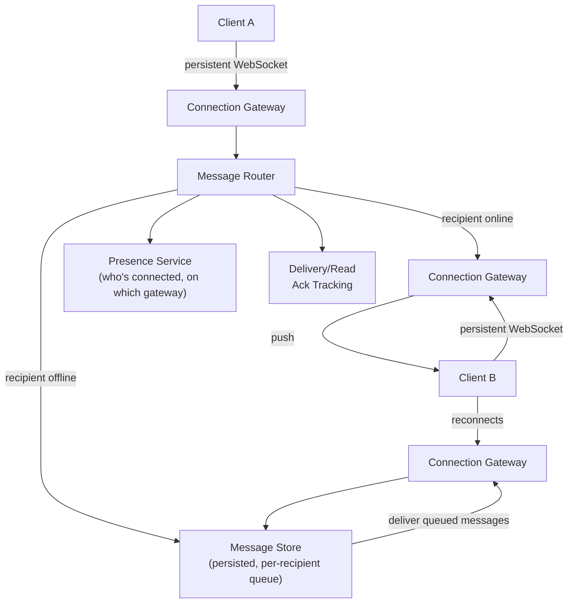

# Design a Chat System (WhatsApp / Messenger)

**Primarily tests**: persistent-connection management at scale, message ordering,
delivery guarantees, and offline-delivery design — a genuinely different skill set from
request/response system design since the server must *push* to clients, not just respond.

## Clarify

- 1:1 messaging, group messaging, or both? (Assume both — group chat introduces its own
  fan-out concern, similar in spirit to the [Twitter feed problem](../02_design_twitter_feed/tutorial.md).)
- Delivery guarantee expectations: is "message delivered, possibly duplicated" acceptable
  (at-least-once), or must it be exactly-once?
- Read receipts / typing indicators / online presence — in scope or not? (These add real
  design surface; confirm before spending time on them.)
- Message persistence: how long are messages retained, and do they need to sync across a
  user's multiple devices?

**Reasonable assumptions**: billions of messages/day, sub-second delivery expectation when
recipient is online, guaranteed eventual delivery when offline, at-least-once delivery
with client-side deduplication.

## High-Level Design

## Deep-Dive: Connection Management at Scale

**The core architectural fact that shapes everything else**: HTTP request/response doesn't
work for server-initiated pushes — the connection needs to stay open (WebSocket, or a
long-polling fallback), and **each gateway server can only hold a bounded number of
concurrent open connections** (limited by file descriptors and memory per connection, not
CPU) — this is a fundamentally different scaling axis than a typical stateless API server.

- **Connection gateways are sharded by connection, not by user** — any gateway can accept
  any client's connection, but *which specific gateway* a given user is currently
  connected to must be tracked centrally (the presence service), since that's the only way
  the message router knows where to push an incoming message.
- **The presence service is effectively a distributed key-value store**
  (`user_id -> gateway_id`) that needs to handle connect/disconnect events at high
  frequency and be **fast and highly available** — a slow presence lookup adds latency to
  every message send, and an unavailable presence service breaks delivery entirely, so it
  typically needs the same low-latency, replicated design as the
  [distributed cache case study](../05_design_distributed_cache/tutorial.md).
- **Gateway failure handling**: if a gateway crashes, every connection it held drops —
  clients detect this (missed heartbeat) and reconnect to a *different* gateway, which
  re-registers their presence. The message router/presence service must treat "gateway
  unreachable" as equivalent to "all its connections are now offline," not leave stale
  presence entries pointing at a dead gateway (a stale entry causes silent message loss —
  the router thinks it delivered a message to a live connection that no longer exists).

## Deep-Dive: Ordering and Delivery Guarantees

- **At-least-once delivery with client-side dedup** is the standard, pragmatic choice:
  each message gets a unique ID (assigned by the sending client, so it's stable even
  across retries); the server may deliver it more than once under failure/retry
  conditions, and the receiving client deduplicates by ID before displaying it. This is
  far simpler to build reliably than true exactly-once delivery, and the client-side cost
  (a set of recently-seen message IDs) is small.
- **Ordering within a conversation**: messages need a well-defined order per-conversation,
  even if delivered slightly out of order over the network. A per-conversation sequence
  number (assigned server-side, monotonically increasing) lets clients buffer and reorder
  briefly if a message arrives out of sequence, rather than displaying messages in
  network-arrival order (which can be visibly wrong to users, especially in group chats
  with multiple senders).
- **Offline delivery**: undelivered messages queue in the per-recipient message store;
  on reconnect, the client fetches everything since its last-acknowledged sequence
  number — this is why the sequence number needs to be durable and per-recipient, not just
  a network-transient ordering hint.

## Deep-Dive: Group Chat Fan-Out

Group messages fan out to every member — structurally the same problem as the
[Twitter feed's celebrity fan-out](../02_design_twitter_feed/tutorial.md#deep-dive-the-fan-out-problem-the-core-of-this-question),
at a smaller scale (groups are capped at some max size, unlike follower counts). A message
to a 200-person group is pushed to the presence service 200 times, or queued 200 times for
offline members — the fan-out cost scales with group size, which is exactly why chat apps
cap group sizes rather than allowing Twitter-scale "groups."

## Trade-offs

| Decision | Option A | Option B | When to pick which |
|---|---|---|---|
| Delivery guarantee | At-least-once + client dedup | Exactly-once (server-side deduplication, more complex) | At-least-once is the standard, pragmatic default; exactly-once only justified for genuinely non-idempotent payloads (rare in chat) |
| Connection protocol | WebSocket (full-duplex, efficient) | Long-polling (simpler, works through more restrictive networks/proxies) | WebSocket as the default; long-polling as a fallback for clients/networks that can't sustain WebSocket connections |
| Message storage | Store every message durably, indefinitely | Store only until delivered + a short retention window | Durable storage if "message history across devices" is a requirement; short retention if the product is closer to ephemeral messaging |
| Presence service consistency | Strongly consistent (accurate but potentially higher latency) | Eventually consistent (brief staleness tolerated) | Eventually consistent is usually acceptable — a few hundred milliseconds of stale presence rarely causes a user-visible problem, and it's far cheaper to run at scale |

## Staff Altitude

A **senior** answer gets WebSocket connections, a router, and message persistence right.

A **staff** answer additionally: (1) explicitly identifies the presence service as the
system's actual bottleneck/single-point-of-concern and designs its availability
requirements accordingly, rather than treating it as an incidental lookup table; (2)
reasons about **multi-device sync** as a first-class requirement affecting the data model
from the start (per-recipient *and* per-device delivery state) rather than a bolt-on; and
(3) names the **organizational cost** of the connection-gateway tier specifically — it's
a stateful tier in an otherwise statelessly-scalable system, which has real operational
consequences (rolling deploys must drain connections gracefully, not just restart pods)
worth calling out unprompted.

## Failure Modes to Raise Proactively

- **A gateway crash losing in-flight (not-yet-acked) messages** — mitigated by not
  considering a message "sent" until the recipient's gateway (or the offline message store)
  has durably accepted it, not just when the sender's gateway received it.
- **Presence service staleness causing messages to be pushed to a dead connection** —
  mitigated by heartbeat-based liveness checks and prompt presence invalidation on
  disconnect, not just on explicit logout.
- **Group chat fan-out to a partially-offline group** creating a large, uneven mix of
  push-delivery and queue-writes in a single logical send — needs to be handled as a
  fan-out operation with partial failure tolerance, not an all-or-nothing transaction.

## Staff Follow-Ups

- "How would you support end-to-end encryption without breaking server-side features like
  push notifications previewing message content?"
- "A user has the app open on their phone and laptop simultaneously — how does 'read'
  status sync between them?"
- "How would you migrate the message store's schema with zero downtime, given billions of
  existing messages?"

## Practice Variations

- Design a video-call signaling system layered on top of this chat infrastructure.
- Design "message reactions" (emoji reactions) as an extension.
- Design a system supporting disappearing/ephemeral messages with guaranteed deletion.

---

**Previous:** [2. Design Twitter/X Feed](../02_design_twitter_feed/tutorial.md)  |  **Next:** [4. Design Ride-Hailing Dispatch](../04_design_ride_hailing_dispatch/tutorial.md)
