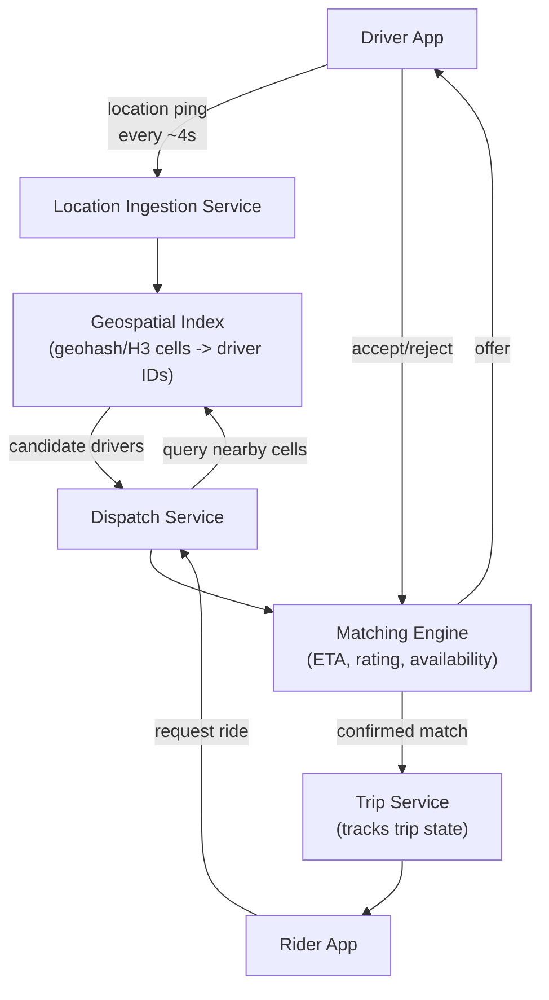

# Design Ride-Hailing Dispatch (Uber / Lyft)

**Primarily tests**: geospatial indexing, real-time high-frequency location updates at
scale, and matching under contention — the specific skill of reasoning about *physical
space* as a sharding/indexing dimension, which most other case studies don't touch.

## Clarify

- Scale: how many active drivers broadcasting location, at what frequency, and how many
  ride requests/sec in a dense city?
- Matching objective: pure nearest-driver, or does it need to account for driver rating,
  ETA (accounting for road networks, not just straight-line distance), or surge pricing?
- Does a driver's location need to be visible in real time to the rider once matched
  (for the "watch your driver approach" map view)?

**Reasonable assumptions**: millions of active drivers globally, location updates every
3-5 seconds per active driver, matching must complete in low hundreds of milliseconds,
straight-line-distance-based ETA as an acceptable simplification (full road-network
routing is a separate, deep sub-problem out of scope for the core dispatch design).

## High-Level Design

## Deep-Dive: Geospatial Indexing (the core of this question)

**The problem**: given a rider's location, find nearby available drivers — a naive
"scan all drivers, compute distance to each" is O(total drivers), completely infeasible
at millions of concurrent drivers with sub-second latency requirements.

- **Geohashing**: encode latitude/longitude into a string where nearby locations share
  longer common prefixes (each additional character narrows the represented area).
  Drivers are indexed by their geohash cell; a nearby-driver query becomes "look up
  drivers in this cell and its 8 neighboring cells" — a small, bounded lookup instead of a
  full scan.
- **The geohash edge-of-cell problem**: two points can be physically very close but fall
  on opposite sides of a cell boundary, ending up with completely different geohash
  prefixes — this is why a real query always checks **neighboring cells too**, not just
  the rider's own cell, and it's the kind of edge case a staff-level answer names
  proactively rather than discovering when asked "what if the closest driver is just
  across a cell boundary?"
- **H3 (Uber's actual open-sourced system) improves on raw geohashing** with a hexagonal
  grid instead of rectangular cells — hexagons have uniform distance to all neighbors
  (a rectangular cell's diagonal neighbor is farther than its edge neighbor, distorting
  "nearby" queries slightly), and hierarchical hexagon indexing supports efficient
  multi-resolution queries (zoom out to a coarser hex if too few drivers found at a fine
  one). Naming H3 specifically, and *why* hexagons fix the rectangular-cell distortion, is
  a strong, specific staff-level signal in this exact question.
- **Index update frequency vs. staleness trade-off**: every driver location ping (every
  ~4 seconds) potentially moves them into a different cell, requiring an index update.
  At scale, this is a very high write-rate index — typically held in-memory (Redis
  geospatial commands, or a custom in-memory grid) rather than a disk-backed index, since
  a few seconds of staleness in driver position is an acceptable trade-off for the write
  throughput this requires.

## Deep-Dive: Matching Under Contention

**The problem specific to dispatch, not present in most other case studies**: multiple
riders can simultaneously be matched to the *same* available driver in the brief window
before that driver accepts/rejects an offer — a race condition with real business
consequences (a driver double-booked, or a rider left waiting after a match silently
fails).

- **Optimistic offer with a short lock**: when the matching engine selects a candidate
  driver, it acquires a short-TTL lock on that driver (a distributed lock, per the
  [foundations tutorial](../01_distributed_systems_foundations/tutorial.md#distributed-locks-zookeeper-etcd))
  before sending the offer — other simultaneous match attempts skip a locked driver and
  move to the next candidate. The TTL must be short enough that a driver who doesn't
  respond (app crashed, no signal) doesn't block that slot indefinitely — this is
  precisely the fencing-token problem from the foundations tutorial, applied concretely:
  what if the lock expires while the accept/reject is still in flight?
- **Batch matching as an alternative to greedy one-at-a-time matching**: instead of
  matching each ride request the instant it arrives, batch requests over a short window
  (a few seconds) and solve a matching optimization across all pending riders and
  available drivers simultaneously — this can produce a globally better assignment (fewer
  total wasted driver-miles) at the cost of a small added latency per request. This is the
  detail a staff-level answer raises as a *deliberate trade-off* (slightly higher latency
  for meaningfully better fleet-wide efficiency), not something a senior answer typically
  reaches without prompting.

## Trade-offs

| Decision | Option A | Option B | When to pick which |
|---|---|---|---|
| Geospatial index | Geohash (simpler, well-understood) | H3 hexagonal (more uniform, more complex) | H3 once scale/precision justifies the added complexity; geohash is a perfectly reasonable starting answer |
| Matching approach | Greedy (match instantly, one request at a time) | Batch (small window, jointly optimized) | Greedy for lowest possible per-request latency; batch when fleet-wide efficiency matters more than the last few hundred milliseconds |
| Location index storage | In-memory (fast, some staleness) | Persisted/replicated durable store | In-memory is the standard choice — driver location is inherently transient, ephemeral state; durability isn't valuable here |
| ETA estimation | Straight-line distance (simple, less accurate) | Road-network-aware routing (accurate, a whole separate system) | Straight-line as a first-pass/interview-scope answer; explicitly name that production systems layer in real routing as a distinct, deep sub-system |

## Staff Altitude

A **senior** answer gets geohashing and a matching service right.

A **staff** answer additionally: (1) names the cell-boundary edge case and the
optimistic-lock race condition *before being asked* — these are the two "obvious once
pointed out" details that separate a working sketch from a production-grade one; (2)
frames the batch-vs-greedy matching choice as a genuine business trade-off (rider wait
time vs. fleet efficiency), the kind of decision that in reality would involve a product
conversation, not a purely technical call made unilaterally; and (3) explicitly scopes out
full road-network routing as its own system with its own team/ownership boundary, rather
than hand-waving it as a detail of this design — recognizing organizational scope
boundaries is itself the staff-level skill from the
[staff-level signal tutorial](../00_staff_level_signal/tutorial.md).

## Failure Modes to Raise Proactively

- **A driver accepts an offer but then the app crashes before trip confirmation reaches
  the rider** — needs an explicit timeout-and-retry/re-match path, not an assumption that
  "accept" is the end of the matching problem.
- **A dense event causing a local spike in ride requests** (concert letting out) —
  geospatial hot-spotting analogous to the hot-key problem in the
  [distributed cache case study](../05_design_distributed_cache/tutorial.md), needing the
  index to handle a highly uneven request distribution across cells, not a uniform one.
- **Location-ingestion pipeline backpressure** under a spike in active drivers — needs the
  same backpressure handling discipline as the
  [ingestion pipeline concepts in the ML track](http://127.0.0.1:8001/02_ingestion_pipeline/tutorial/#backpressure).

## Staff Follow-Ups

- "How would you handle surge pricing consistently, so two riders in the same area at the
  same moment see the same surge multiplier?"
- "How would you support ride-pooling (multiple riders sharing a trip), given the matching
  engine currently assumes one rider per driver?"
- "What changes about this design in a market with spotty cellular connectivity, where
  driver location pings arrive late or out of order?"

## Practice Variations

- Design a food-delivery dispatch system (similar core problem, plus a restaurant-prep-time
  dimension).
- Design "surge pricing" as a subsystem, focusing on consistency across concurrent riders.
- Extend this design to support scheduled (book-ahead) rides alongside on-demand ones.

---

**Previous:** [3. Design a Chat System](../03_design_chat_system/tutorial.md)  |  **Next:** [5. Design a Distributed Cache](../05_design_distributed_cache/tutorial.md)
