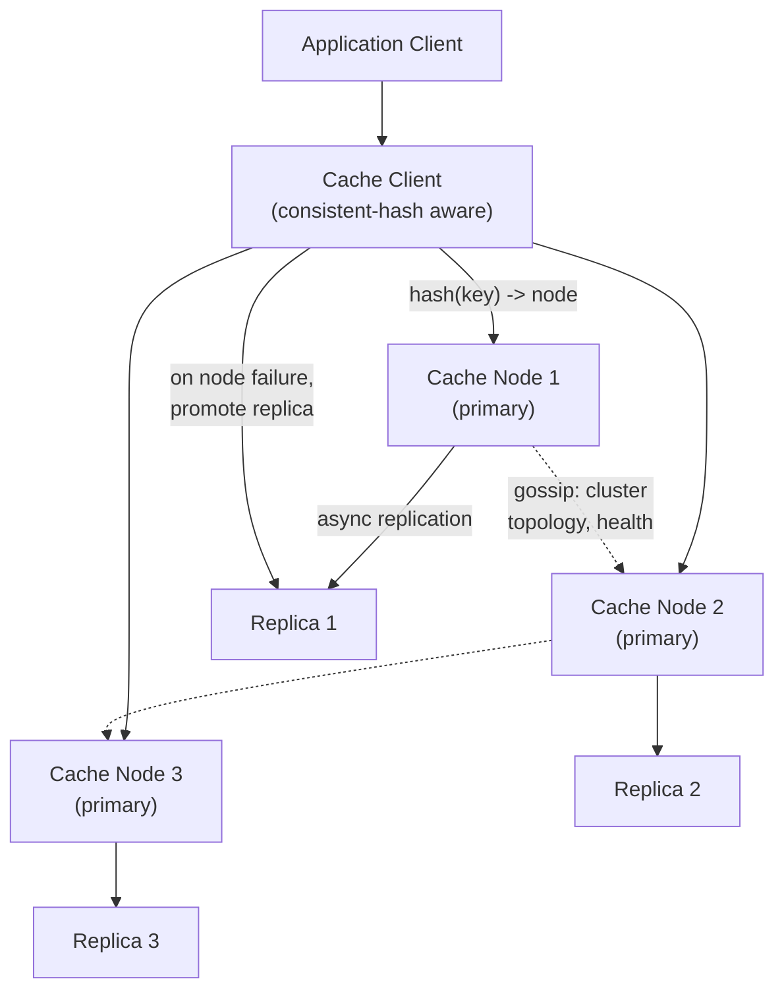

# Design a Distributed Cache (Redis Cluster)

**Primarily tests**: consistent hashing in practice, replication for availability, and two
of the most common real-world cache failure modes — the hot-key problem and cache
stampede — which are exactly the kind of "this looks solved until you push on it" details
staff rounds probe.

## Clarify

- Read-heavy or write-heavy workload? (Assume read-heavy — the dominant real-world case
  for caching.)
- Consistency requirement: is briefly stale cached data acceptable (almost always yes for
  a cache, by definition), or does this need read-your-own-writes guarantees?
- Eviction policy requirements — is a simple LRU sufficient, or does the workload need
  something smarter (e.g., frequency-aware)?
- Expected key-space size and value size — does everything fit in memory across the
  cluster, or is this fundamentally a subset-of-data cache?

## High-Level Design

## Deep-Dive: Consistent Hashing in Practice

Covered mechanically in the
[foundations tutorial](../01_distributed_systems_foundations/tutorial.md#consistent-hashing-advanced-sharding)
— here's how it actually shows up in a real cache cluster's design:

- **Redis Cluster specifically uses a fixed 16384 "hash slots"** rather than a pure
  continuous ring — each key hashes to one of 16384 slots, and each node owns a range of
  slots. This is a practical middle ground: resharding means moving *slot ownership*
  (a manageable, discrete unit), not recomputing a continuous ring position per key.
- **Virtual nodes/slots smooth load distribution** — a node can own multiple
  non-contiguous slot ranges, so adding a new node means redistributing a calculated
  number of slots to it from existing nodes, rather than one large contiguous chunk from a
  single unlucky neighbor.
- **Resharding is a live operation**: slots are migrated one at a time while the cluster
  continues serving traffic — the client library needs to handle a `MOVED` or `ASK`
  redirect response (this key's slot has moved / is mid-migration) gracefully, retrying
  against the new node transparently. This client-side redirect handling is a detail worth
  naming explicitly — it's *why* resharding can happen without a maintenance window.

## Deep-Dive: The Hot-Key Problem

**The problem**: consistent hashing distributes *keys* evenly, but it says nothing about
*access frequency* per key — a single extremely popular key (a viral post's like-count,
a flash-sale product's inventory) can receive vastly disproportionate traffic, overloading
the one node that owns its slot, even though the cluster overall has plenty of spare
capacity.

- **This is fundamentally different from the general load-imbalance problem** consistent
  hashing already solves — no amount of better key-distribution hashing helps, because the
  problem isn't key placement, it's that *one specific key* is hot.
- **Mitigation: client-side local caching for known-hot keys** — cache the hottest keys'
  values briefly in the application layer itself (in-process, not the distributed cache),
  absorbing read traffic before it ever reaches the distributed cache tier at all.
- **Mitigation: key replication/sharding for hot keys specifically** — detect hot keys
  (via access-frequency monitoring) and replicate *that specific key's* value across
  multiple nodes (e.g. `hot_key#0`, `hot_key#1`, ... `hot_key#9`), with clients randomly
  choosing a replica — spreading one hot key's load across multiple nodes instead of
  concentrating it on the single node consistent hashing would otherwise assign it to.
- **The staff-level framing**: this requires *detecting* hotness in the first place (an
  access-frequency monitoring layer feeding back into the caching strategy) — proposing
  the mitigation without proposing how hotness gets detected and where the threshold lives
  is an incomplete answer.

## Deep-Dive: Cache Stampede (Thundering Herd)

**The problem**: when a popular cached key expires, many concurrent requests can
simultaneously miss the cache, all fall through to the origin/database at once, and
hammer it with duplicate, redundant load for the same data — at high enough traffic, this
can take down the origin store the cache was protecting in the first place.

- **Mitigation: request coalescing (single-flight)** — when a cache miss occurs, only the
  *first* request for that key actually queries the origin; concurrent requests for the
  same key wait on that in-flight result and share it, rather than each independently
  hitting the origin.
- **Mitigation: probabilistic early expiration** — refresh a cache entry slightly *before*
  its TTL actually expires, with a small random jitter per key, so cached entries don't all
  expire at exactly the same synchronized moment even if they were all written at the same
  time.
- **Mitigation: stale-while-revalidate** — serve the slightly-stale cached value
  immediately while asynchronously refreshing it in the background, rather than blocking
  the request on a fresh origin fetch at all — trades a small amount of staleness for
  eliminating the stampede risk entirely.
- **The staff-level framing**: these three mitigations aren't mutually exclusive — a
  mature production cache typically layers request coalescing (handles the immediate
  concurrent-miss case) with jittered TTLs (reduces how often synchronized expiration
  happens in the first place). Presenting them as a layered defense, not a single silver
  bullet, is the stronger answer.

## Trade-offs

| Decision | Option A | Option B | When to pick which |
|---|---|---|---|
| Replication | Async (faster writes, small window of data loss on failover) | Sync (safer, higher write latency) | Async is standard for a cache — the data is, by definition, reconstructable from the source of truth, so the small loss window is usually acceptable |
| Eviction policy | LRU (simple, good general default) | LFU or a custom policy | LRU as the default; LFU when access patterns are genuinely skewed toward a stable set of frequently-reused keys rather than recency-driven access |
| Hot-key mitigation | Client-side local caching | Server-side key replication | Client-side for read-mostly hot keys where brief local staleness is fine; server-side replication when even a few seconds of client-cache staleness is unacceptable |
| Consistency | Cache-aside (application manages cache population) | Write-through (cache updated synchronously with the write) | Cache-aside is the more common, simpler default; write-through when read-after-write consistency through the cache specifically matters |

## Staff Altitude

A **senior** answer designs consistent hashing, replication, and a reasonable eviction
policy.

A **staff** answer additionally: (1) proactively raises the hot-key and cache-stampede
problems as the two failure modes that actually cause real production incidents in
systems like this, rather than waiting to be asked "what could go wrong"; (2) frames
hot-key mitigation as requiring an entire **detection** subsystem, not just a mitigation
technique — the harder, less obvious half of the problem; and (3) recognizes that a cache
cluster's operational profile (rolling restarts, node failures, resharding) needs to be
designed for *continuous availability during operational events*, which is a different
concern from steady-state read/write performance.

## Failure Modes to Raise Proactively

- **A node failure during active resharding** — the migration state itself needs to be
  resumable/idempotent, not left in a half-migrated, ambiguous-ownership state.
- **Split-brain during a network partition** between the cluster's nodes — needs a
  consensus-backed mechanism (per the [foundations tutorial](../01_distributed_systems_foundations/tutorial.md#consensus-making-multiple-nodes-agree-on-one-truth))
  to agree on which side of a partition is authoritative, to avoid two nodes both
  believing they own the same slot range.
- **Memory pressure evicting keys faster than expected** under a workload change —
  monitoring eviction rate as a first-class metric, not just cache hit rate, since a
  rising eviction rate is often the earliest warning sign of an undersized cluster.

## Staff Follow-Ups

- "How would you migrate this cluster to a different node count with zero cache-miss
  spike during the transition?"
- "How do you monitor for an emerging hot key before it becomes an incident?"
- "What changes if this cache needs to span multiple regions?"

## Practice Variations

- Design a distributed session store (similar mechanics, different consistency
  requirements around session invalidation).
- Design a CDN's edge caching layer (extends this with geographic distribution — see the
  [video streaming case study](../08_design_video_streaming/tutorial.md)).
- Design a leaderboard system (a specific, well-known hot-key-prone workload).

---

**Previous:** [4. Design Ride-Hailing Dispatch](../04_design_ride_hailing_dispatch/tutorial.md)  |  **Next:** [6. Design a Distributed Message Queue](../06_design_distributed_message_queue/tutorial.md)
