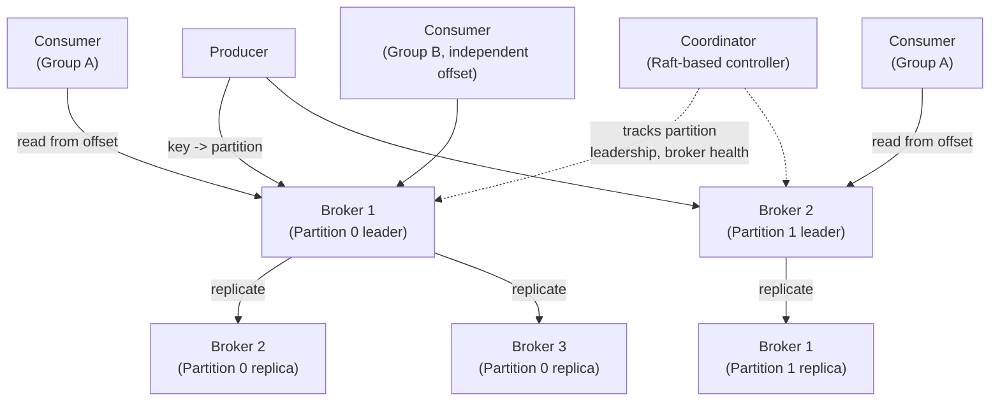

# Design a Distributed Message Queue (Kafka Internals)

**Primarily tests**: log-structured storage, partitioning and replication together, and
exactly-once semantics — designing the actual internals of the infrastructure most other
case studies just treat as a given building block.

## Clarify

- Ordering guarantee needed: global ordering (expensive, rarely truly required) or
  per-key ordering (the common, practical requirement)?
- Delivery semantics: at-most-once, at-least-once, or exactly-once?
- Retention: are messages consumed-and-discarded, or does the log need to be replayable
  (consumers re-reading historical messages, new consumers joining and reading from the
  start)?
- Throughput target: this system's entire design is shaped by needing to sustain very high
  write throughput (millions of messages/sec across a cluster) — confirm that's actually
  the requirement before over-designing for it.

## High-Level Design

## Deep-Dive: Log-Structured Storage (Why It's Fast)

**The core architectural insight**: a message queue's storage is an **append-only log** —
writes are always sequential appends to the end of a file, never random-access
updates. Sequential disk writes are dramatically faster than random writes (even on SSDs,
and especially on spinning disks, which is what made this design revolutionary when
Kafka was introduced) — this single decision is *why* a log-structured queue can sustain
much higher write throughput than a traditional database-backed queue.

- **Segments**: the log for a partition isn't one infinite file — it's split into
  fixed-size **segments**, rolling to a new segment file once the current one hits a size/
  time threshold. This makes retention-based deletion cheap: deleting old data means
  deleting whole old segment files, not scanning and removing individual records.
- **Offsets**: each message in a partition gets a monotonically increasing offset (just
  its position in the log) — a consumer's "position" is simply a stored offset number,
  making "resume from where I left off" or "replay from the beginning" trivial: just set
  the offset and start reading sequentially from there.
- **Zero-copy reads**: serving a consumer's read can use OS-level `sendfile` to transfer
  data directly from disk cache to network socket without copying through user-space
  application memory — a specific, nameable optimization that's part of *why* this
  architecture achieves such high throughput, worth mentioning if pushed on "why is this
  fast" beyond "it's sequential."

## Deep-Dive: Partitioning and Replication Together

- **Partitioning provides parallelism**: a topic is split into multiple partitions,
  each independently ordered, distributed across brokers — this is what lets total
  throughput scale horizontally (more partitions, more brokers, more parallel writers/
  readers), at the cost of **only per-partition ordering being guaranteed**, not global
  ordering across the whole topic.
- **Key-based partitioning determines ordering scope**: producers typically hash a
  message key to choose a partition — messages with the *same key* always land in the same
  partition and are therefore strictly ordered relative to each other, while messages with
  different keys have no ordering guarantee relative to one another. This is the practical
  resolution to "global ordering is expensive" — most real use cases only need ordering
  *per entity* (per user, per order ID), which key-based partitioning provides for free.
- **Replication for durability**: each partition has a leader broker (handles all reads/
  writes) and follower replicas that copy its log. The **In-Sync Replica (ISR) set** is
  the set of followers currently caught up with the leader — a write is only considered
  "committed" once it's been replicated to enough of the ISR (configurable), directly
  trading off durability against write latency.
- **Leader election on broker failure** uses the same consensus mechanism discussed in the
  [foundations tutorial](../01_distributed_systems_foundations/tutorial.md#consensus-making-multiple-nodes-agree-on-one-truth) —
  modern Kafka uses a Raft-based controller quorum specifically to decide which ISR member
  becomes the new leader when the current leader fails, ensuring no committed message is
  lost in the process (only a replica that was fully caught up is eligible to become
  leader).

## Deep-Dive: Exactly-Once Semantics

This is the hardest, most staff-level part of this topic — most systems settle for
at-least-once (as the [chat system case study](../03_design_chat_system/tutorial.md#deep-dive-ordering-and-delivery-guarantees)
does); explaining *why* exactly-once is hard and what it actually requires is the signal:

- **The problem**: a producer retry (due to a network timeout, without knowing whether the
  original write actually succeeded) can result in the same message being written twice —
  at-least-once by default.
- **Idempotent producers**: each producer gets a unique ID and attaches a sequence number
  to each message it sends per partition; the broker deduplicates retries bearing a
  sequence number it's already seen from that producer — this alone solves duplicate
  writes *from retries*, though not duplicates from a fully independent re-send.
- **Transactions across partitions**: for a "read from topic A, process, write to topic B"
  pipeline to be exactly-once end-to-end, the read-offset-commit and the write to topic B
  must be atomic together — achieved via a transaction coordinator that marks a batch of
  writes across multiple partitions as committed atomically, so a consumer configured to
  only read "committed" messages never sees a partial, in-progress transaction.
- **The staff-level framing**: exactly-once is achievable *within this system's boundary*
  (producer → topic → consumer, all within Kafka's transactional guarantees) but does
  **not** extend automatically to side effects outside it (a consumer that processes a
  message and then calls an external API) — that still requires the consumer's own
  idempotency handling, exactly the pattern discussed in the
  [ingestion pipeline tutorial](http://127.0.0.1:8001/02_ingestion_pipeline/tutorial/#idempotency).
  Naming this boundary explicitly — "exactly-once inside Kafka, still your responsibility
  at the edges" — is what separates understanding the mechanism from reciting the term.

## Trade-offs

| Decision | Option A | Option B | When to pick which |
|---|---|---|---|
| Ordering scope | Per-key ordering (partitioned) | Global ordering (single partition) | Per-key almost always — global ordering sacrifices all parallelism and is rarely a genuine business requirement once examined closely |
| Delivery semantics | At-least-once + idempotent consumer | Exactly-once (transactional) | At-least-once as the pragmatic default; exactly-once when the consumer's side effect genuinely can't tolerate any duplicate (e.g., a non-idempotent financial debit) |
| Replication factor | Higher (e.g. 3, more durable, more storage cost) | Lower (e.g. 2, cheaper, less durable) | Higher for data where loss is unacceptable; lower where the data is either reconstructable or low-value enough to accept the risk |
| Retention | Time-based (delete after N days) | Log-compacted (keep only the latest value per key, forever) | Time-based for event streams; compaction for "latest state per key" use cases (e.g. a changelog feeding a cache) |

## Staff Altitude

A **senior** answer gets partitioning, replication, and consumer groups right.

A **staff** answer additionally: (1) explains *why* log-structured storage is fast
(sequential I/O, zero-copy) rather than just naming "it's a log"; (2) correctly scopes
exactly-once semantics to *within* the system's boundary and explicitly calls out that
external side effects still need consumer-side idempotency — a subtlety many "I know
Kafka" answers get wrong by implication; and (3) reasons about **partition count as a
long-term, hard-to-change decision** — repartitioning an existing topic breaks the
key-to-partition mapping consumers depend on for ordering, so staff-level answers treat
initial partition count as a capacity-planning decision made deliberately upfront, not a
parameter to casually adjust later.

## Failure Modes to Raise Proactively

- **A slow consumer falling far behind (consumer lag)** — needs monitoring as a first-class
  metric; unbounded lag growth eventually risks the consumer reading from a segment that's
  been deleted by retention policy, silently losing data it never got to process.
- **An under-replicated partition** (some ISR members have fallen behind) reducing
  effective durability below the configured replication factor — needs alerting distinct
  from "broker is down," since the partition is still serving traffic while degraded.
- **A "poison pill" message** that a consumer can never successfully process, blocking
  that partition's consumption indefinitely — needs a dead-letter/skip mechanism, the same
  pattern from the [ingestion pipeline tutorial](http://127.0.0.1:8001/02_ingestion_pipeline/tutorial/#retry-failure-handling).

## Staff Follow-Ups

- "How would you add more partitions to a topic that's already in production, without
  breaking existing consumers' ordering assumptions?"
- "How do you handle a consumer group needing to reprocess the last 24 hours of data after
  discovering a bug in its processing logic?"
- "What's your strategy for cross-region replication of this queue, and what does that do
  to your durability/latency guarantees?"

## Practice Variations

- Design a pub/sub notification fan-out system on top of this queue.
- Design a change-data-capture (CDC) pipeline streaming database changes through this
  system.
- Design the exactly-once payment-event pipeline explicitly, using this queue as the
  backbone.

---

**Previous:** [5. Design a Distributed Cache](../05_design_distributed_cache/tutorial.md)  |  **Next:** [7. Design a Rate Limiter at Global Scale](../07_design_rate_limiter_at_scale/tutorial.md)
