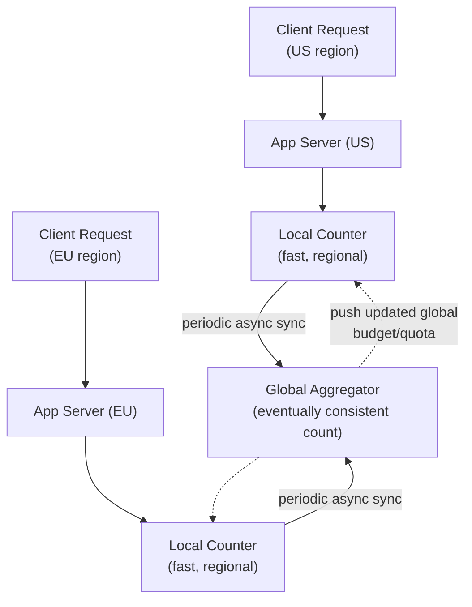

# Design a Rate Limiter at Global Scale

**Primarily tests**: distributed counting, clock synchronization, and the
approximate-vs-exact enforcement trade-off. Extends the
[single-node rate limiter in the ML track's fundamentals tutorial](http://127.0.0.1:8001/01_fundamentals/tutorial/#worked-example-design-a-rate-limiter)
(one Redis instance, one counting algorithm) to the genuinely harder problem: enforcing
one global limit per user/API-key when requests land on servers spread across multiple
regions.

## Clarify

- Is the limit **per-region** (each region enforces its own independent quota — much
  simpler) or **truly global** (a user's total requests across all regions combined must
  stay under one limit)? Assume truly global — that's the version that's actually hard.
- Hard cutoff or throttling/backoff signal?
- How much overshoot is tolerable? (This single answer determines almost the entire
  design — see below.)

## High-Level Design

## Deep-Dive: Why "Just Use One Redis Instance Globally" Doesn't Work

The single-node answer (one Redis instance, atomic increment-and-check) is the correct
*starting* answer, and it's exactly where a senior-level response stops. The staff-level
question is: **what happens when app servers in the US and EU both need to check the same
global counter for every request?**

- **A single global counter store** means every request, regardless of region, makes a
  network round-trip to wherever that store lives — for a user in Asia checking against a
  US-hosted counter, this adds significant latency to *every single request*, defeating
  the purpose of having regional app servers at all.
- **This is a direct instance of the CAP-theorem trade-off** from the
  [ML track's fundamentals tutorial](http://127.0.0.1:8001/01_fundamentals/tutorial/#cap-theorem-consistency-models):
  a perfectly accurate global count requires either a single source of truth (a latency
  and availability bottleneck) or synchronous cross-region coordination on every request
  (a consensus-style cost, per the
  [foundations tutorial](../01_distributed_systems_foundations/tutorial.md#consensus-making-multiple-nodes-agree-on-one-truth)) —
  neither is acceptable at the latency budget a rate limiter needs to operate within
  (it must add negligible overhead to every request it protects).

## Deep-Dive: The Practical Answer — Local Enforcement + Async Global Reconciliation

- **Each region gets a local budget** — a fraction of the total global limit, allocated
  to that region (proportional to its typical traffic share, or dynamically rebalanced).
  Requests are checked against this **local** counter, at local latency — no cross-region
  call on the request's critical path at all.
- **Regions periodically report their local usage to a global aggregator** (every few
  seconds), which recomputes actual global usage and can push back adjusted local budgets
  — a region running hot gets a smaller allocation next cycle; an idle region's spare
  budget can be redistributed.
- **This is explicitly an approximate enforcement mechanism**: for the few seconds between
  reconciliation cycles, the true global count can drift above the nominal limit by a
  bounded amount (at most, roughly the sum of what each region could independently spend
  before the next sync). **State this bound explicitly as a design parameter** — "we
  tolerate up to N% overshoot, bounded by the reconciliation interval" — rather than
  presenting the design as if it enforces the limit exactly, which it does not and cannot
  at this latency budget.
- **When exact enforcement genuinely is required** (a hard business/legal limit, not just
  a soft throttle), the answer changes: accept the latency cost of a synchronous check
  against a single authoritative store for that specific limit, and scope that
  exact-enforcement requirement narrowly (e.g., only for the specific action that legally
  must not exceed the limit), rather than applying the expensive synchronous pattern to
  every rate-limited endpoint uniformly.

## Deep-Dive: Clock Synchronization

Any rate-limiting algorithm using time windows (fixed window, sliding window — see the
[fundamentals tutorial's algorithm table](http://127.0.0.1:8001/01_fundamentals/tutorial/#worked-example-design-a-rate-limiter))
depends on consistent notions of time across regions:

- **Clock drift between regions' servers** can cause a window boundary to be interpreted
  slightly differently in different places — usually a minor issue for approximate
  enforcement, but worth naming as a reason exact, tight time-window boundaries are
  another place this design is inherently approximate, not a precision instrument.
- **NTP-synchronized clocks** are the practical baseline expectation; for anything
  requiring tighter guarantees, logical/vector clocks (per the
  [foundations tutorial](../01_distributed_systems_foundations/tutorial.md#crdts-vector-clocks-resolving-conflicts-without-coordination))
  establish relative ordering without depending on wall-clock precision at all — worth
  mentioning as the "if we truly needed it" answer, while noting it's usually overkill for
  a rate limiter's actual accuracy requirements.

## Trade-offs

| Decision | Option A | Option B | When to pick which |
|---|---|---|---|
| Enforcement scope | Per-region independent limits (simple, no cross-region coordination) | Global limit with async reconciliation (complex, matches the actual business requirement) | Per-region if the business requirement can be restated as "per-region," which is worth explicitly asking about before building the harder version |
| Reconciliation frequency | Frequent (tighter global accuracy, more sync overhead) | Infrequent (looser accuracy, less overhead) | Tune based on the tolerable-overshoot bound established during clarification — this is a quantitative decision, not a guess |
| Overshoot handling | Hard rejection once local budget exhausted | Soft throttle/backoff signal, allow some overshoot | Soft throttling is more forgiving of the inherent approximation in this design; hard rejection is simpler but makes the overshoot bound feel more like a bug than a designed trade-off |
| Exact vs. approximate | Approximate (this design) | Exact via synchronous global check | Exact only for the narrow subset of limits with a genuine hard requirement — applying it universally reintroduces the latency/availability problem this whole design exists to avoid |

## Staff Altitude

A **senior** answer proposes a single global counter and, if pushed, acknowledges it adds
latency.

A **staff** answer additionally: (1) immediately identifies that a single global counter
is a CAP-theorem trade-off in disguise and proposes local-enforcement-plus-reconciliation
without needing to be pushed there; (2) makes the **overshoot bound a named, quantified
design parameter** rather than an unstated approximation — this is the single detail that
most distinguishes a staff answer here; and (3) explicitly asks whether the "global limit"
requirement is even real, or an unexamined assumption — often a business requirement
stated as "no user should exceed X globally" actually tolerates being restated as
"per-region, which sums to approximately X" once the actual motivation (protecting a
downstream dependency, say) is understood, which is dramatically simpler to build.

## Failure Modes to Raise Proactively

- **The global aggregator becoming a single point of failure** — if reconciliation can't
  reach it, regions should fail toward their **last-known-good local budget**, not fail
  open (unbounded) or fail closed (reject everything) by default — state which failure
  direction is appropriate for this specific limit's purpose.
- **A region's traffic share shifting suddenly** (a viral event in one region) — a static
  regional budget allocation would under-serve that region while others sit under-
  utilized; dynamic rebalancing based on recent usage, not a fixed split, handles this.
- **Reconciliation lag compounding under aggregator slowness** — if the aggregator itself
  falls behind, the overshoot bound silently grows past its designed value; this needs its
  own monitoring and alerting, not just monitoring of the rate limiter's primary function.

## Staff Follow-Ups

- "The business now needs a *hard* legal limit for one specific action, while everything
  else stays approximate — how do you evolve this design to support both without
  duplicating the whole system?"
- "How would you test that your overshoot bound actually holds under a real traffic
  spike, not just in theory?"
- "A new region needs to be added — walk through how its initial budget allocation is
  determined before there's any usage history to base it on."

## Practice Variations

- Design a global unique-ID generator (a related "needs global coordination but can't
  afford synchronous global calls" problem — see Twitter Snowflake-style approaches).
- Design a distributed quota system for a multi-tenant API platform, where tenants have
  wildly different traffic patterns.
- Extend this design to support a "burst allowance" (short bursts above the sustained
  limit are permitted) on top of the base global-limit design.

---

**Previous:** [6. Design a Distributed Message Queue](../06_design_distributed_message_queue/tutorial.md)  |  **Next:** [8. Design a Video Streaming Service](../08_design_video_streaming/tutorial.md)
