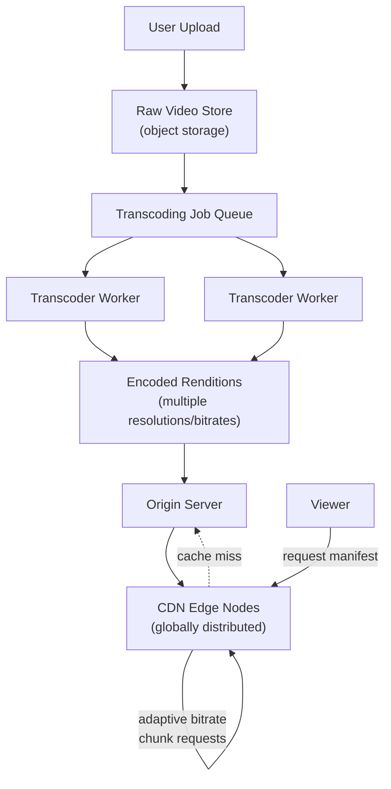

# Design a Video Streaming Service (YouTube / Netflix)

**Primarily tests**: transcoding pipeline design, adaptive bitrate streaming, and CDN
architecture — a system split cleanly into two very different halves (an asynchronous,
throughput-oriented upload/processing pipeline, and a latency-critical global delivery
path), which is itself worth naming as the first architectural insight.

## Clarify

- Upload-and-process (YouTube-style, user-generated content) or a fixed, pre-produced
  catalog (Netflix-style)? Assume the harder, more general case: user uploads at scale.
- Live streaming in scope, or video-on-demand only? Assume VOD only — live streaming
  (low-latency requirements, different transcoding constraints) is a meaningfully
  different problem worth scoping out explicitly.
- Global audience — multi-region delivery is a core requirement, not an add-on.

## High-Level Design

## Deep-Dive: The Transcoding Pipeline

**The problem**: a single uploaded video must be converted into multiple resolutions and
bitrates (240p through 4K, at several bitrate tiers each) to support playback across
device types and network conditions — this is a computationally expensive, embarrassingly
parallel batch job, structurally very different from the rest of the system's real-time
serving path.

- **Chunking the source video for parallel transcoding**: rather than transcoding an
  entire video serially, split it into short segments (a few seconds each) and transcode
  segments in parallel across a worker fleet — this is what makes transcoding latency
  roughly constant regardless of video length, rather than scaling linearly with it.
- **A job queue** (structurally the message queue from the
  [distributed message queue case study](../06_design_distributed_message_queue/tutorial.md))
  coordinates work distribution across the transcoder fleet, with the same retry/dead-
  letter handling discipline from the
  [ingestion pipeline tutorial](http://127.0.0.1:8001/02_ingestion_pipeline/tutorial/#retry--failure-handling)
  for segments that fail to transcode.
- **Priority tiers**: a popular creator's upload, or content flagged for faster
  availability, can jump the queue — this is a real product requirement (not just a
  technical nicety) worth naming: "processing priority" is itself a design decision with
  fairness and cost implications across the whole platform, not a purely technical
  detail.

## Deep-Dive: Adaptive Bitrate Streaming (ABR)

**The problem**: a viewer's available bandwidth changes during playback (switching from
WiFi to cellular, network congestion) — the video player needs to adjust quality
seamlessly without the viewer noticing a hard cut or buffering stall.

- **Manifest files** (HLS or DASH format) describe the available renditions (resolution/
  bitrate combinations) and where their segments live — the player downloads the manifest
  first, then requests individual segments.
- **The player, not the server, makes the ABR decision**: it monitors recent download
  throughput and buffer health, and picks the next segment's quality tier accordingly —
  this is a client-side algorithm, which matters architecturally because it means the
  server-side system doesn't need to track per-viewer network conditions at all; it just
  needs every rendition's segments available for the player to choose from.
- **Segment duration is a deliberate trade-off**: shorter segments (2-4 seconds) allow
  faster quality-switching reaction time but add more request overhead (more manifest
  entries, more individual HTTP requests); longer segments reduce overhead but make quality
  transitions coarser and slower to react to changing conditions.

## Deep-Dive: CDN Architecture and Cache Invalidation

- **Origin-and-edge structure**: the origin server holds the authoritative copy of every
  rendition; CDN edge nodes (geographically distributed) cache popular content close to
  viewers, serving the vast majority of requests without ever reaching the origin — this
  is the same origin/cache relationship as the
  [distributed cache case study](../05_design_distributed_cache/tutorial.md), applied to
  static video segments instead of dynamic key-value data.
- **Cache warming for anticipated popular content**: rather than waiting for organic cache
  misses to populate edge caches (which would mean the *first* viewers in a region get
  origin-latency performance), a platform can proactively push newly-published, expected-
  to-be-popular content to edge nrodes ahead of viewer demand — a deliberate trade-off of
  bandwidth cost now for guaranteed low-latency delivery to early viewers.
- **The long-tail problem**: most content is *not* popular enough to justify caching at
  every edge node — a CDN needs a policy for less-popular content (regional caching
  tiers, or falling back to origin more readily) rather than assuming uniform
  cache-everywhere-forever behavior, which would be prohibitively expensive at the scale
  of a platform with a large content catalog.
- **Cache invalidation** is comparatively rare for this system (a published video's
  segments essentially never change — the content is immutable once transcoded) — this is
  actually a simplifying property worth stating explicitly: unlike a typical
  read/write cache invalidation problem, this CDN mostly deals with cold-start population,
  not update propagation, since content deletion/takedown is the rare exception rather
  than routine invalidation.

## Trade-offs

| Decision | Option A | Option B | When to pick which |
|---|---|---|---|
| Transcoding priority | FIFO (simple, fair) | Priority tiers (faster for high-value content) | Priority tiers once the platform has a genuine product reason (creator tier, promoted content) to differentiate — otherwise FIFO avoids the fairness complexity |
| Segment duration | Short (2-4s, fast ABR reaction) | Long (6-10s, less overhead) | Short for highly variable network conditions (mobile-heavy audience); long where network conditions are typically stable |
| CDN cache population | Reactive (cache on first miss) | Proactive (pre-warm anticipated popular content) | Proactive for known high-anticipation releases; reactive as the default for the long tail of ordinary uploads |
| Storage of renditions | Keep all renditions forever | Delete rarely-viewed high renditions after a cold period, re-transcode on demand | Keep-forever for a platform prioritizing instant availability; re-transcode-on-demand as a real cost optimization for a catalog with a long, rarely-accessed tail |

## Staff Altitude

A **senior** answer gets transcoding, ABR, and a CDN layer right.

A **staff** answer additionally: (1) explicitly separates this system into its two
architecturally distinct halves (asynchronous throughput-oriented processing vs.
latency-critical global delivery) as the first framing move, since conflating them leads
to a muddled design; (2) treats **storage cost at scale** as a first-class design
concern — with potentially billions of videos each stored in ~10 renditions, storage cost
optimization (the keep-vs-re-transcode trade-off above) becomes a genuine multi-million-
dollar decision, not an afterthought; and (3) recognizes transcoding priority as an
organizational/product decision requiring alignment with business stakeholders, not a
purely technical queue-ordering choice made unilaterally.

## Failure Modes to Raise Proactively

- **A transcoding worker crash mid-job** — needs the segment-level retry/resume discipline
  from the ingestion pipeline tutorial, not a restart-the-whole-video-from-scratch fallback.
- **A cache-invalidation need for content takedowns** (copyright claims, policy
  violations) — the rare case where this system *does* need fast, reliable invalidation
  across every edge node globally, worth designing for explicitly rather than assuming
  content is always immutable-forever.
- **Origin overload during a cold-cache event** (a surprise viral video with no
  pre-warming) — needs origin-side rate limiting/backpressure (per the
  [rate limiter case study](../07_design_rate_limiter_at_scale/tutorial.md)) to avoid the
  origin itself becoming the bottleneck during the initial cache-population spike.

## Staff Follow-Ups

- "How would you support live streaming on top of this architecture, and what
  fundamentally changes?"
- "How do you handle a copyright takedown that needs to propagate to every CDN edge node
  within minutes, globally?"
- "What's your strategy for reducing storage cost for a catalog where 90% of views go to
  10% of content?"

## Practice Variations

- Design a live-streaming platform (Twitch-style), focusing on what changes from the VOD
  design above.
- Design a podcast/audio-only streaming service (a simpler variant, useful for contrasting
  what complexity is video-specific).
- Design the content-recommendation system sitting on top of this platform (connects to
  the [Twitter feed case study's](../02_design_twitter_feed/tutorial.md) ranking
  discussion).

---

**Previous:** [7. Design a Rate Limiter at Global Scale](../07_design_rate_limiter_at_scale/tutorial.md)  |  **Next:** [9. Design a Web Crawler](../09_design_web_crawler/tutorial.md)
