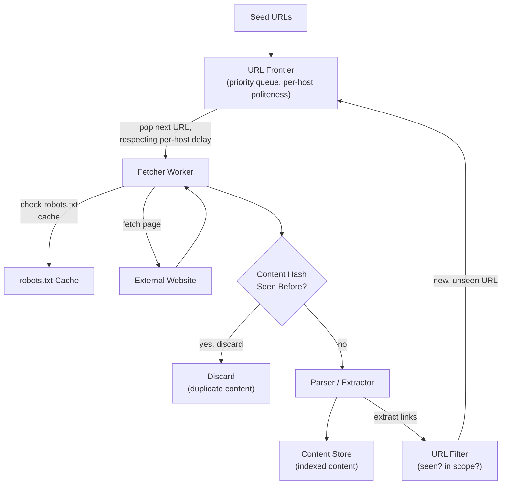

# Design a Web Crawler

**Primarily tests**: URL frontier design, politeness constraints, and deduplication at
scale — a system whose central hard problem is scheduling *fairly and politely* across
millions of independent, uncooperative external domains, not raw throughput.

## Clarify

- Scope: crawl the whole web, or a bounded set of seed domains? Assume broad, web-scale
  crawling.
- Freshness requirement: is this a one-time crawl, or does previously-crawled content need
  periodic re-crawling to detect changes?
- Politeness requirement: crawlers must respect `robots.txt` and avoid overwhelming any
  single site — assume this is a hard requirement, not optional.
- Content scope: HTML only, or also need to handle/extract from PDFs, images, JS-rendered
  pages? Assume HTML-primary, with JS-rendering explicitly scoped out as a follow-up
  extension.

## High-Level Design

## Deep-Dive: The URL Frontier (the core of this question)

**The problem**: a naive single FIFO queue of URLs to crawl would let one domain
monopolize crawler capacity (if a site has millions of internal links, a simple queue
would crawl that one site exhaustively before ever getting to others) and would hammer
individual servers with rapid-fire concurrent requests — both are the opposite of
respectful, effective web crawling.

- **Per-host queues, not one global queue**: maintain a separate sub-queue per host
  (domain), with a scheduler that round-robins across hosts — this structurally guarantees
  fairness across domains regardless of how many URLs any single domain contributes.
- **Per-host politeness delay**: each host's sub-queue enforces a minimum delay between
  consecutive requests to that host (configurable, often informed by the host's own
  `robots.txt` crawl-delay directive if present) — implemented as, essentially, a
  per-host rate limiter, structurally the same problem as the
  [rate limiter case study](../07_design_rate_limiter_at_scale/tutorial.md) but scoped per
  external domain instead of per internal user/API-key.
- **Priority within the frontier**: not all URLs are equally valuable to crawl first — a
  priority score (based on estimated page importance, e.g. a PageRank-style signal, or
  simply freshness needs for previously-crawled pages due for re-crawl) determines
  ordering within and across host queues, so crawler capacity is spent on high-value
  content first rather than purely FIFO discovery order.
- **The frontier itself must be distributed** at web scale — a single machine can't hold
  the URL frontier for a web-scale crawl. Partitioning the frontier by host hash (so all
  of a given host's URLs and politeness state live on one frontier shard) keeps
  per-host politeness enforcement simple — a fetcher worker only needs to coordinate
  politeness state with the one frontier shard responsible for that host, not the whole
  cluster.

## Deep-Dive: Deduplication at Scale

Two genuinely different deduplication problems, easy to conflate:

- **URL-level dedup** (don't crawl the same URL twice): given the enormous number of URLs
  discovered over a large crawl, checking "have we seen this URL" against an
  exact-match set becomes a memory problem at scale — a **Bloom filter** is the standard
  answer: a probabilistic set membership structure with a small, fixed false-positive rate
  and dramatically less memory than storing every URL string. A false positive here means
  occasionally skipping a URL that was actually new (a minor, acceptable loss at web
  scale) — false negatives (never happens by construction) would be the actually
  problematic failure mode, and Bloom filters guarantee no false negatives.
- **Content-level dedup** (different URLs serving identical or near-identical content —
  extremely common on the web: mirrors, syndicated content, URL parameters that don't
  change content): requires hashing page *content* (not the URL) and checking that hash
  against previously-seen content hashes. **Near-duplicate detection** (pages that are
  almost, but not exactly, identical — e.g. the same article with a different ad banner)
  needs a fuzzier technique like MinHash/SimHash rather than an exact content hash, which
  would treat near-identical pages as entirely distinct.

## Deep-Dive: Politeness and robots.txt

- **`robots.txt` must be fetched and cached per-host** before crawling any page on that
  host, respected as a hard constraint (which paths are disallowed, and any crawl-delay
  directive) — this is a correctness/legal-and-ethical requirement, not a performance
  optimization, worth stating explicitly as a hard design constraint rather than a nice-to-
  have.
- **Caching `robots.txt` with a TTL** avoids re-fetching it before every single page
  request to the same host, while still picking up changes periodically (a site's
  crawl policy can change over time).
- **User-agent identification**: a crawler should identify itself clearly (a distinctive
  user-agent string, ideally with contact information) — this is both an ethical crawling
  practice and a practical one, since it lets site operators reach out if the crawler is
  causing problems, rather than simply blocking it outright.

## Trade-offs

| Decision | Option A | Option B | When to pick which |
|---|---|---|---|
| Frontier structure | Single global queue (simple, fails at scale) | Per-host queues with round-robin scheduling | Per-host is the only real answer at any meaningful scale — a global queue is what a senior answer might start with before the fairness problem is raised |
| URL dedup | Exact set (accurate, memory-heavy) | Bloom filter (small memory, small false-positive rate) | Bloom filter at web scale, always — the memory savings are enormous and the false-positive cost (occasionally re-skipping a new URL) is negligible |
| Crawl freshness | One-time crawl | Continuous re-crawl with priority based on observed change frequency | Continuous re-crawl for any long-lived index (search engines); one-time is rare outside of narrow, bounded research crawls |
| Content dedup | Exact content hash only | Exact hash + near-duplicate detection (MinHash/SimHash) | Near-duplicate detection once the crawl target includes syndicated/mirrored content at any meaningful volume — very common on the open web |

## Staff Altitude

A **senior** answer designs a URL frontier, fetchers, and basic dedup.

A **staff** answer additionally: (1) explicitly separates URL-level and content-level
deduplication as two distinct problems requiring different data structures, rather than
conflating them into "dedup" generically; (2) frames politeness/`robots.txt` compliance as
a **non-negotiable design constraint driven by legal/ethical obligation**, not a
performance knob to tune — a subtle but real distinction in how the requirement is framed;
and (3) reasons about **re-crawl prioritization as a resource-allocation problem under a
fixed crawling budget** — with finite crawler capacity, deciding what to re-crawl (and how
often) based on observed change frequency and page importance is itself a significant,
staff-worthy sub-design, not an afterthought bolted onto "crawl everything periodically."

## Failure Modes to Raise Proactively

- **A malicious or misconfigured site serving an infinite sequence of auto-generated
  links** (a "crawler trap") — needs a bounded per-host crawl depth/count limit, or the
  frontier for that one host grows unboundedly and starves crawling capacity for
  everything else.
- **A host serving different content based on user-agent or request patterns** (cloaking)
  — the crawler may index content different from what real users see; worth naming as a
  known limitation rather than assuming crawled content always matches the real user
  experience.
- **DNS resolution becoming a bottleneck** at high fetch concurrency across many distinct
  hosts — needs its own caching layer, easy to overlook when focused on the frontier/
  fetch design.

## Staff Follow-Ups

- "How would you prioritize re-crawling a page that changes daily versus one that hasn't
  changed in years, under a fixed total crawl budget?"
- "How do you handle a site that's temporarily down — retry immediately, back off, or
  deprioritize entirely?"
- "How would this design change to support crawling JavaScript-rendered single-page
  applications?"

## Practice Variations

- Design a sitemap-based crawler (a more targeted, cooperative variant using sites'
  published sitemaps rather than pure link discovery).
- Design a plagiarism/duplicate-content detection system reusing this crawler's
  content-dedup mechanisms.
- Design a price-monitoring crawler (bounded set of known e-commerce sites, high
  re-crawl frequency, structured data extraction) — a narrower, different-shaped variant
  of this same core problem.

---

**Previous:** [8. Design a Video Streaming Service](../08_design_video_streaming/tutorial.md)  |  **Next:** [10. Design Search Autocomplete](../10_design_search_autocomplete/tutorial.md)
