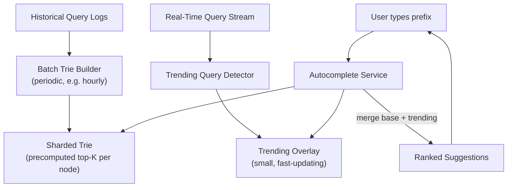

# Design Search Autocomplete (Typeahead)

**Primarily tests**: distributed trie design, ranking under a brutal latency budget, and
handling real-time trending updates — a system where the core data structure choice
(a trie) is well-known, but making it work distributed, ranked, and freshness-aware at
scale is where the staff-level depth actually lives.

## Clarify

- Latency budget: this is typically the tightest latency requirement of any system in this
  section — sub-100ms, since it fires on every keystroke. Confirm this explicitly; it
  shapes almost every subsequent decision.
- Personalization: same suggestions for everyone, or personalized by user history/
  location? Assume a global-popularity baseline with personalization as an extension.
- Freshness: must newly-trending queries (breaking news, a sudden viral topic) appear in
  suggestions within minutes, or is daily/hourly batch freshness acceptable? Assume
  near-real-time trending is a real requirement — it's the detail that makes this problem
  interesting.

## High-Level Design

## Deep-Dive: The Trie, and Why Naive Traversal Isn't Enough

**The starting point**: a trie (prefix tree) naturally supports "give me everything
starting with this prefix" — walk to the node matching the typed prefix, then traverse
the subtree beneath it to collect all completions. This is the correct data structure
choice and most candidates get here quickly; the staff-level depth is in what comes next.

- **The problem with naive subtree traversal**: for a short, common prefix (`"a"`), the
  subtree beneath that trie node can be enormous — traversing it live on every request to
  find the top suggestions is far too slow for a sub-100ms budget.
- **Precompute top-K at every node**: instead of traversing at request time, precompute
  and cache the top-K most popular completions **at every trie node**, built from
  historical query frequency — a request for prefix `"a"` becomes an O(1) lookup of that
  node's precomputed top-K list, not a live subtree scan. This is the single most
  important design decision in this system, and it's the detail that separates "I know
  what a trie is" from actually solving the latency requirement.
- **This precomputation is a batch process**, rebuilding (or incrementally updating) the
  trie's top-K annotations periodically from aggregated query logs — this is why the
  high-level design has two distinct data paths (a slow, thorough batch path building the
  base trie, and a fast, narrow real-time path for trending overlays), mirroring the
  bronze/silver/gold batch-processing pattern from the
  [ML track's ingestion pipeline tutorial](http://127.0.0.1:8001/02_ingestion_pipeline/tutorial/),
  applied here to search-query logs instead of ML training data.

## Deep-Dive: Sharding a Trie

At web scale, the trie itself is too large for one machine — but tries don't shard as
cleanly as key-value data (there's no natural hash of "prefix" that preserves the tree
structure across shards).

- **Shard by first N characters**: e.g., all prefixes starting with `"a"`-`"m"` on shard 1,
  `"n"`-`"z"` on shard 2 (with sub-sharding within heavily-loaded letters as needed) — this
  keeps each prefix's *entire* subtree on a single shard, so any single autocomplete query
  only ever needs to hit one shard, avoiding a scatter-gather across the whole cluster for
  every keystroke.
- **The uneven-load problem this creates**: query prefixes are not remotely uniformly
  distributed (far more queries start with common letters/patterns than rare ones) — this
  is a structurally similar problem to the
  [distributed cache's hot-key problem](../05_design_distributed_cache/tutorial.md#deep-dive-the-hot-key-problem),
  except here the "hot key" is an entire heavily-trafficked shard rather than a single
  cache key. Mitigated the same conceptual way: uneven shard sizing (give hot prefix
  ranges more machines/replicas than cold ones) rather than assuming uniform shard
  capacity is sufficient.

## Deep-Dive: Real-Time Trending Overlay

**The problem**: the precomputed, batch-built trie reflects historical popularity — it
cannot, by construction, know about a topic that started trending in the last few
minutes, and rebuilding the entire trie in real time is neither necessary nor feasible.

- **A small, separate, fast-updating structure** tracks only *currently surging* queries
  (detected via a streaming count of recent query frequency, flagging terms whose
  frequency has spiked sharply relative to their historical baseline) — this overlay is
  orders of magnitude smaller than the full trie, so it can be updated continuously
  without needing the full trie's batch-rebuild treatment.
- **At request time, the autocomplete service merges** the base trie's precomputed
  suggestions with the trending overlay's currently-surging matches for the same prefix,
  re-ranking the combined set — this merge-at-read-time pattern is the same architectural
  shape as the
  [Twitter feed's celebrity fan-in merge](../02_design_twitter_feed/tutorial.md#deep-dive-the-fan-out-problem-the-core-of-this-question):
  a cheap precomputed base, merged with a small, fresh, separately-maintained overlay, at
  read time.
- **The staff-level framing**: this two-tier structure (slow-changing batch base +
  fast-changing small overlay) is a recurring pattern worth naming explicitly as a pattern,
  not just a solution to this one problem — it shows up anywhere a system needs both
  "mostly stable, expensive to compute" and "occasionally spiky, cheap to compute
  incrementally" data merged at serving time.

## Trade-offs

| Decision | Option A | Option B | When to pick which |
|---|---|---|---|
| Ranking computation | Precompute top-K per trie node (fast reads, batch-updated) | Compute ranking live per request (always fresh, too slow at required latency) | Precompute is the only viable choice given the latency budget — live computation is what a senior answer might propose before the latency math is worked through |
| Trie sharding | By prefix range (keeps subtrees together, uneven load) | By hash of full query (even load, breaks prefix locality entirely) | By prefix range — hash-based sharding would require querying every shard for every request, defeating the point of sharding here |
| Trending detection | Streaming spike detection (fast, some false positives on noise) | Batch trend analysis (more accurate, too slow for "trending now" requirement) | Streaming detection, accepting some noise, since the entire point of this component is sub-minute freshness |
| Personalization | None (global popularity only) | Per-user re-ranking on top of global base | Per-user re-ranking as an additive layer once the global base system works — building personalization in from the start conflates two different hard problems |

## Staff Altitude

A **senior** answer proposes a trie with precomputed top-K suggestions and a reasonable
sharding scheme.

A **staff** answer additionally: (1) explicitly identifies the real-time trending
requirement as needing an architecturally *separate* fast-path structure, rather than
trying to force real-time freshness into the same batch-built trie; (2) names the
uneven-shard-load problem as structurally the same class of problem as hot keys elsewhere
in the system (showing the ability to transfer a pattern across different case studies,
not just solve each in isolation); and (3) recognizes personalization as a *layer on top
of* a working global system rather than a requirement to design in from the start —
correctly sequencing which problem to solve first is itself a staff-level judgment call.

## Failure Modes to Raise Proactively

- **A shard serving an extremely hot prefix range becoming a latency outlier** — needs
  monitoring per-shard latency specifically, not just aggregate system latency, to catch
  this before it's user-visible.
- **The trending detector flagging noise as a trend** (a small absolute increase in a
  rarely-searched term looking like a huge relative spike) — needs a minimum absolute
  volume threshold combined with the relative-spike signal, not relative change alone.
- **Offensive or inappropriate content trending and appearing in suggestions** — needs an
  explicit content-moderation filter in the trending pipeline specifically, since this
  path bypasses the more curated, historically-vetted base trie.

## Staff Follow-Ups

- "How would you incorporate personalization without duplicating the entire trie
  infrastructure per user?"
- "How do you handle a prefix with zero historical data (a genuinely brand-new term) —
  what does the user see?"
- "Walk through how you'd A/B test a change to the ranking algorithm without affecting all
  users simultaneously."

## Practice Variations

- Design a "did you mean" spell-correction system layered on top of this autocomplete
  system.
- Design a product-search autocomplete for an e-commerce site (adds inventory/pricing
  freshness constraints on top of the base problem).
- Design a code-completion (IDE autocomplete) system — a structurally related problem in a
  very different domain, useful for testing whether the underlying pattern (precomputed
  base + fast incremental overlay) actually generalizes in your own understanding.

---

**Previous:** [9. Design a Web Crawler](../09_design_web_crawler/tutorial.md)  |  **Next:** [Back to Overview](../README.md)
