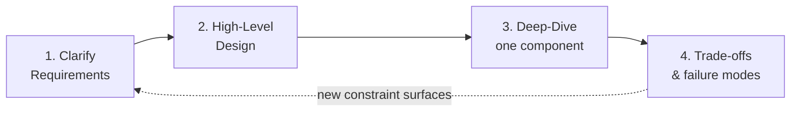
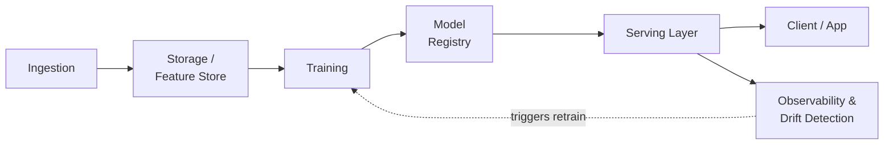

# The System Design Interview Framework

Every tutorial in this section is written around one four-step structure. Internalize this
once and it transfers to every design question you'll get, ML-specific or not.

## Step 1: Clarify Requirements

This is the step senior candidates get scored on the hardest, and the step most candidates
rush through. The questions you ask here signal seniority more than anything you say later
— they show you know that "design a recommendation system" is underspecified until you've
pinned down scale, latency, and consistency needs.

**Ask about, in roughly this order:**

1. **Functional scope** — what does the system actually need to do? (e.g. "batch scoring
   only, or real-time inference too?")
2. **Scale** — requests/sec, data volume, number of models/features, number of users.
   Orders of magnitude change the design: 100 req/s and 100K req/s are different systems,
   not the same system with more servers.
3. **Latency requirements** — p50/p99 targets, and *why* (a fraud-check API and a nightly
   batch report have wildly different latency budgets — don't assume "fast" means the same
   thing in both).
4. **Consistency needs** — can this tolerate eventual consistency, or does it need strong
   consistency? (Directly determines database/replication choices later.)
5. **Failure tolerance** — what's the cost of a wrong answer vs. no answer vs. a slow
   answer? (A model returning a slightly stale recommendation is fine; a fraud model
   returning nothing when it should block a transaction is not.)
6. **Existing constraints** — cloud provider, team size, budget, must-integrate-with
   systems. Real systems are built inside constraints, not on a blank slate — asking this
   shows you've actually shipped something.

**A concrete sentence to have ready:** *"Before I sketch anything, can I confirm the scale
we're targeting and the latency budget — I want to design for the actual constraint, not a
generic version of this system."* That one sentence, asked before you touch the whiteboard,
does more for your signal than most of what follows it.

## Step 2: High-Level Design

Sketch the major components and how data flows between them — boxes and arrows, not
implementation detail yet. For ML systems specifically, the recurring shape is:

Every tutorial in this section is one piece of this larger loop, zoomed in. Naming this
whole loop out loud in the first 30 seconds of your high-level design — even before you
zoom into your assigned piece — is a strong senior signal: it shows you see where the
requested component sits in the broader ML lifecycle, not just in isolation.

## Step 3: Deep-Dive One Component

The interviewer usually steers this, but come prepared to *offer* a component to deep-dive
into rather than waiting passively — it shows you know which part of your design is
actually interesting or risky. Good candidates for a self-initiated deep-dive:

- The part with the tightest latency constraint.
- The part most likely to fail under load or partial outage.
- The part where you made a non-obvious trade-off in the high-level sketch (call it out:
  *"I glossed over X here — want me to go deeper on how that actually works?"*).

Go deep enough to write pseudocode, a schema, or a sequence diagram — not just more boxes.

## Step 4: Trade-offs & Failure Modes

This is the step senior interviewers weight heaviest, and it's a discussion, not a
monologue — expect pushback and follow-up "what if" questions. For every major decision in
your design, be ready to state:

- **What you chose, and the specific alternative you rejected.** ("I chose eventual
  consistency here over strong consistency because—" beats "I used eventual consistency.")
- **What breaks it.** Every component you drew can fail, be slow, or receive bad/adversarial
  input — name the failure mode before the interviewer asks, and say what happens next
  (retry? fallback? degrade gracefully? page someone?).
- **What you'd change at 10x scale.** This is a favorite follow-up because it tests whether
  your design choices were principled or accidental.

## The Trade-off Vocabulary Cheat Sheet

Fluently naming these axes — and which side of each axis your design landed on, and why —
is most of what "senior" sounds like in these interviews.

| Axis | One side | Other side | Where it shows up |
|---|---|---|---|
| Consistency vs. Availability | Strong consistency (CP) | High availability (AP) | Feature stores, model registries under partition |
| Latency vs. Throughput | Optimize for fast individual responses | Optimize for total requests/sec | Real-time serving vs. batch scoring |
| Freshness vs. Cost | Real-time features/retraining | Cached/batch features, periodic retraining | Feature store design, drift response |
| Accuracy vs. Latency | Larger model, better accuracy | Smaller/quantized model, faster inference | Model-serving deep-dive, LLM serving |
| Build vs. Buy | Hand-roll (more control) | Managed tool — Feast, KServe, Pinecone | Almost every "what would you use for X" question |
| Push vs. Pull | Push updates to consumers immediately | Consumers poll/pull on their schedule | Feature freshness, monitoring pipelines |
| Coupling | Tightly coupled (simpler, less flexible) | Loosely coupled via queues/events (more resilient, more ops overhead) | Ingestion pipelines, serving-to-monitoring hookup |

## A Reusable Opening Line

When a design question comes in cold, this ordering keeps you from freezing or rambling:

1. Restate the problem in your own words in one sentence.
2. Ask 2-4 clarifying questions from the list above (don't ask all of them — pick the ones
   that actually change your design).
3. State the resulting scale/latency/consistency targets *out loud* before drawing
   anything — this anchors the rest of the conversation and gives the interviewer a chance
   to correct you early, cheaply, instead of 15 minutes in.
4. Sketch the high-level loop, narrating each box's purpose in one clause as you draw it.
5. Propose a deep-dive target yourself, then follow where the interviewer steers.
6. Close every component you discuss with its trade-off and failure mode, unprompted.

## How the Rest of This Section Uses This Framework

Each of the six topic tutorials is structured as: core concepts → reference architecture →
a deep-dive walkthrough → a trade-off table → failure modes → a "Make It Yours" section
prompting you to attach your own RAE/GRM specifics → practice questions. That structure
*is* this framework, applied to one recurring ML-systems topic at a time.

---

**Previous:** [Overview](../README.md)  |  **Next:** [1. Fundamentals & Building Blocks](../01_fundamentals/tutorial.md)
