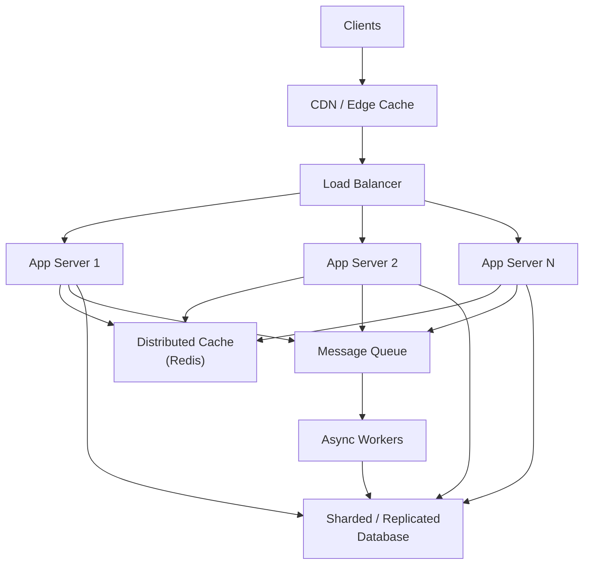

# Fundamentals: The Building Blocks

**Weeks 1-2 of Track B.** This is the vocabulary every later tutorial assumes. If any of
these six concepts feel shaky, spend your warm-up weeks here rather than rushing to the
ML-specific topics — every ML system design question decomposes into these primitives plus
model-specific concerns.

## Core Concepts

### Load Balancing

Distributes incoming requests across multiple servers so no single one is overwhelmed.

- **Algorithms:** round robin (simple, ignores server load), least connections (routes to
  the server with fewest active requests), weighted (accounts for heterogeneous server
  capacity), consistent hashing (routes the *same* key to the *same* server — critical for
  caching and session affinity).
- **Layer 4 vs Layer 7:** L4 balances on IP/port (fast, protocol-agnostic); L7 balances on
  HTTP content (can route by path/header — e.g. send `/v2/predict` to a different model
  version than `/v1/predict`, which is exactly how canary routing works later).

### Caching

Stores frequently-accessed data closer to where it's needed, trading staleness for speed.

- **Where:** client-side, CDN, application-layer (Redis/Memcached), database query cache.
- **Eviction policies:** LRU (evict least-recently-used — the default choice unless you
  have a specific reason otherwise), LFU (evict least-frequently-used), TTL-based
  (evict after a fixed time — the natural fit for anything with a freshness requirement,
  like cached features or model predictions).
- **The hard problem isn't caching — it's invalidation.** Always state your invalidation
  strategy explicitly: write-through (update cache on every write, strong consistency,
  more write latency), write-behind (update cache immediately, persist to the source of
  truth asynchronously, risk of loss on crash), or TTL-only (simplest, accepts staleness up
  to the TTL window).

### Sharding / Partitioning

Splits data across multiple machines so no single machine holds (or must serve) everything.

- **Strategies:** range-based (simple, risks hot shards if access is skewed — e.g.
  sharding by date puts all of "today's" traffic on one shard), hash-based (spreads load
  evenly, sacrifices efficient range queries), directory-based (a lookup service maps keys
  to shards — most flexible, adds a dependency and a hop).
- **The recurring failure mode to name proactively:** *hot shards* — uneven access
  patterns concentrating load on one partition despite an even data distribution. Mitigate
  with better key design (e.g. salting a hot key) or dynamic re-sharding.

### Replication

Keeps copies of data on multiple machines for durability and read scalability.

- **Leader-follower (primary-replica):** writes go to one leader, reads can be served from
  followers — the standard pattern; the trade-off is replication lag (followers can serve
  stale reads).
- **Multi-leader / leaderless:** higher write availability, but now you need a conflict
  resolution strategy (last-write-wins, vector clocks, application-level merge) — bring
  this up yourself if a design needs multi-region writes, since it's a common follow-up
  trap.

### Message Queues

Decouple producers from consumers, absorb bursty load, and enable retry/backoff without
blocking the producer.

- **Point-to-point (SQS-style):** each message consumed by exactly one consumer — the
  default choice for work distribution (e.g. "process this uploaded file").
- **Pub/sub (SNS/Kafka-style):** each message delivered to every subscriber — the fit when
  multiple independent systems need to react to the same event (e.g. "a new model was
  promoted to prod" fanning out to monitoring, cache invalidation, and a Slack notifier).
- **Dead-letter queues (DLQ):** messages that fail processing after N retries land here
  instead of blocking or silently dropping — always mention this when discussing a queue's
  failure mode; "what happens to a message that keeps failing" is a near-universal
  follow-up.

### CAP Theorem & Consistency Models

Under a network partition, you must choose between consistency (every read sees the latest
write) and availability (every request gets a response). You can't have both.

- **CP systems** (e.g. a model registry recording "which model version is currently in
  prod") typically favor consistency — serving a stale answer about what's in production
  is actively dangerous.
- **AP systems** (e.g. a feature cache serving recommendations) typically favor
  availability — a slightly stale feature value beats no response at all.
- **Eventual consistency** is the common middle ground: writes propagate asynchronously,
  and the system converges given enough time without new writes.
- Naming *which* of these your design chose, and why, for each stateful component is
  exactly the trade-off vocabulary from [the framework guide](../00_interview_framework/tutorial.md#the-trade-off-vocabulary-cheat-sheet).

## Reference Architecture: A Generic Scalable Service

## Worked Example: Design a Rate Limiter

A favorite warm-up question — small enough to finish in 20 minutes, but touches most of the
fundamentals above.

**Clarify:** Per-user or global limit? Hard cutoff or throttling? Distributed across
multiple servers (almost always yes in a real system — this is the crux of the problem)?

**High-level design:** A shared counter store (Redis) that every app server checks before
processing a request, so the limit is enforced consistently regardless of which server
handles a given request.

**Deep-dive — the algorithm choice:**

| Algorithm | How it works | Trade-off |
|---|---|---|
| Fixed window counter | Count requests in discrete time windows (e.g. per-minute) | Simple, but allows 2x burst at window boundaries |
| Sliding window log | Store a timestamp per request, count those within the trailing window | Accurate, but O(requests) memory per key |
| Sliding window counter | Weighted average of current + previous fixed window | Good accuracy/memory trade-off — the usual production choice |
| Token bucket | Tokens refill at a fixed rate; a request consumes a token | Naturally allows controlled bursts — good fit for API rate limiting |

**Trade-offs & failure modes:** What happens when Redis itself is slow or down — fail open
(allow all requests, risk overload) or fail closed (reject all requests, guaranteed
availability loss)? Most production systems fail open for rate limiters specifically,
since the limiter protecting availability shouldn't itself become the outage.

## Make It Yours

Before your next mock interview, write two or three sentences (mentally or on paper)
answering each:

- Where in RAE or GRM did you actually choose between consistency and availability for a
  component? What made you pick the side you picked?
- What's a hot-shard or hot-partition problem you've hit (or would expect) in a system
  you've built — how would you describe the mitigation?
- Which caching invalidation strategy have you actually implemented, and what broke when
  it was wrong?

## Practice Questions

- Design a URL shortener.
- Design a distributed rate limiter (walked through above — try it yourself first).
- Design a key-value store that needs to survive a single data-center failure.

---

**Previous:** [0. The Interview Framework](../00_interview_framework/tutorial.md)  |  **Next:** [2. High-Throughput Ingestion Pipelines](../02_ingestion_pipeline/tutorial.md)
