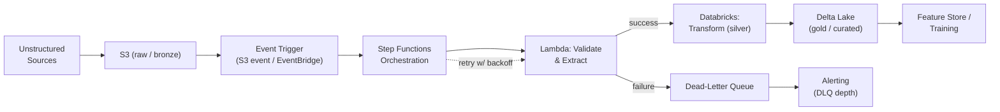

# High-Throughput Ingestion Pipelines for Unstructured Data

**Weeks 3-4 of Track B.** Anchor: your RAE-style pipeline (Step Functions/Lambda/S3/
Databricks). This tutorial covers the general design space that pipeline sits in, so you
can reason about it beyond the specific tools you used.

## Core Concepts

### Batch vs. Streaming — and Why It's Rarely a Clean Binary

- **Batch:** process accumulated data on a schedule or trigger (hourly, on-file-arrival).
  Simpler to reason about, easier to reprocess, higher latency by nature.
- **Streaming:** process each record (near-)immediately as it arrives. Lower latency,
  fundamentally harder to reason about (ordering, late-arriving data, exactly-once
  semantics).
- **Micro-batching** (Spark Structured Streaming's default mode) is the common middle
  ground: small, frequent batches that get most of streaming's latency with most of
  batch's operational simplicity. Naming this option yourself is a strong signal — it shows
  you know the choice isn't binary.
- The real question to clarify up front: **what's the actual latency requirement**, not
  "does this feel like a streaming problem." A lot of "streaming" requirements turn out to
  tolerate 5-15 minute batch latency just fine, which is a much simpler system to build and
  operate.

### Idempotency

The single most important property an ingestion pipeline must have, because retries *will*
happen (network blips, Lambda timeouts, downstream backpressure) and you cannot let a retry
double-process a record.

- **Techniques:** deterministic idempotency keys (hash of content + source, not a random
  UUID generated at retry time), upserts instead of inserts (`MERGE`/`ON CONFLICT` keyed on
  that idempotency key), checkpointing consumed offsets only *after* successful downstream
  writes (not before — this is the classic bug: checkpointing early means a crash between
  checkpoint and write silently loses the record).

### Retry & Failure Handling

- **Exponential backoff with jitter** — naive fixed-interval retries synchronize into
  thundering herds against a struggling downstream dependency; jitter spreads them out.
- **Dead-letter queues (DLQ)** — after N retries, move the failed message aside rather than
  blocking the pipeline or dropping it silently. Always pair this with **alerting on DLQ
  depth**, not just its existence — a DLQ nobody watches is just a silent data-loss queue
  with extra steps.
- **Poison pill handling** — a single malformed record that always fails shouldn't be able
  to block an entire partition/shard behind it; isolate and DLQ it instead of retrying
  forever.

### Backpressure

What happens when producers create data faster than consumers can process it.

- **Buffer** (queue depth absorbs bursts, but has a limit) → **throttle the producer**
  (reject or delay new writes once buffers fill) → **scale consumers** (the actual fix,
  but takes time to kick in) → **shed load** (drop lowest-priority work under sustained
  overload, if the domain allows it).
- Name this chain explicitly when discussing "what happens under a traffic spike" — it's a
  near-universal follow-up for any ingestion design.

### Schema Evolution

Unstructured/semi-structured data sources change shape over time (a new field appears, a
type changes) without warning, and your pipeline shouldn't break when they do.

- **Schema-on-read vs. schema-on-write:** schema-on-write (validate/enforce at ingestion)
  catches problems early but is brittle to upstream changes; schema-on-read (store raw,
  interpret at query time) is more resilient but pushes validation cost downstream.
- **A practical middle ground:** land raw data as-is (schema-on-read, cheap, resilient),
  then apply a validated, versioned schema at the transformation step that produces
  curated/feature-ready data — this is exactly the medallion (bronze/silver/gold)
  architecture Databricks popularized, and it's worth naming by that term since it signals
  familiarity with the ecosystem.

## Reference Architecture

## Deep-Dive: Designing the Retry & Idempotency Layer

This is the highest-value component to volunteer for a deep-dive in this topic, since it's
where most real ingestion outages actually originate.

1. **Every record gets a deterministic idempotency key** at the earliest possible point —
   typically a hash of `(source_id, content_hash, ingestion_date)` — not a key generated at
   write time, which would differ across retries and defeat the purpose.
2. **Each processing step is designed to be safely re-runnable**: writes are upserts keyed
   on that idempotency key, not blind inserts or appends.
3. **Step Functions' built-in retry policy** (exponential backoff, configurable max
   attempts) wraps each Lambda invocation; after exhausting retries, the state machine
   routes to a failure branch that writes to a DLQ (an SQS dead-letter queue is the natural
   fit) instead of failing the whole execution.
4. **A separate, low-frequency Lambda drains the DLQ** on a schedule, attempting
   reprocessing after transient issues (e.g. a downstream outage) have cleared — with a cap
   on total reprocessing attempts before requiring manual triage.
5. **Alerting is on DLQ depth crossing a threshold**, not on individual failures — a single
   failed record is expected and handled; a growing DLQ is the actual incident signal.

## Trade-offs

| Decision | Option A | Option B | When to pick which |
|---|---|---|---|
| Orchestration | Step Functions (managed, visual, AWS-native) | Airflow/Kubeflow (more flexible, more ops overhead) | Step Functions when already AWS-committed and workflows are mostly linear; Airflow when you need complex cross-system DAGs or are multi-cloud |
| Processing latency | Streaming (near real-time) | Micro-batch/batch (simpler, cheaper) | Streaming only when the actual business requirement demands sub-minute latency — verify this in Step 1 (Clarify) rather than assuming |
| Schema enforcement | Schema-on-write (strict, brittle) | Schema-on-read (flexible, resilient) | Schema-on-write for the curated/gold layer where downstream consumers need guarantees; schema-on-read for the raw/bronze landing zone |
| Failure handling | Fail the whole batch on any bad record | Isolate and DLQ the bad record, continue processing | DLQ-and-continue almost always wins for unstructured data at scale — one malformed file shouldn't block a million good ones |

## Failure Modes to Raise Proactively

- **A retry storm against a struggling downstream dependency** — mitigated by exponential
  backoff with jitter, and a circuit breaker that stops retrying entirely once failure rate
  crosses a threshold, giving the dependency room to recover.
- **A poison-pill record blocking a partition** — mitigated by per-record isolation (not
  per-batch failure) and DLQ routing.
- **Silent schema drift breaking downstream consumers** — mitigated by schema validation at
  the bronze-to-silver boundary, with alerting on validation failure rate, not just hard
  failure.
- **Checkpoint/write ordering bugs causing silent data loss** — always checkpoint *after*
  confirmed downstream write, never before.

## Make It Yours

- What was the actual idempotency key (or equivalent) in your RAE pipeline — and what did
  you do before you had one, if anything broke because of it?
- Describe a specific retry storm or poison-pill incident you've seen or would expect —
  what was the fix?
- What's your pipeline's actual latency requirement, and did you build for that number or
  for a stricter one "just in case"? (Being honest about over-engineering here is itself a
  good trade-off story.)

## Practice Questions

- Design an ingestion pipeline for unstructured documents (PDFs, images) arriving at
  10,000/hour, feeding a downstream ML training pipeline.
- Design a system that ingests clickstream events and must never process the same event
  twice, even under Lambda retries.
- Your ingestion pipeline's DLQ is growing steadily — walk through how you'd diagnose it
  live.

---

**Previous:** [1. Fundamentals & Building Blocks](../01_fundamentals/tutorial.md)  |  **Next:** [3. Feature Store & Model Promotion](../03_feature_store_model_promotion/tutorial.md)
