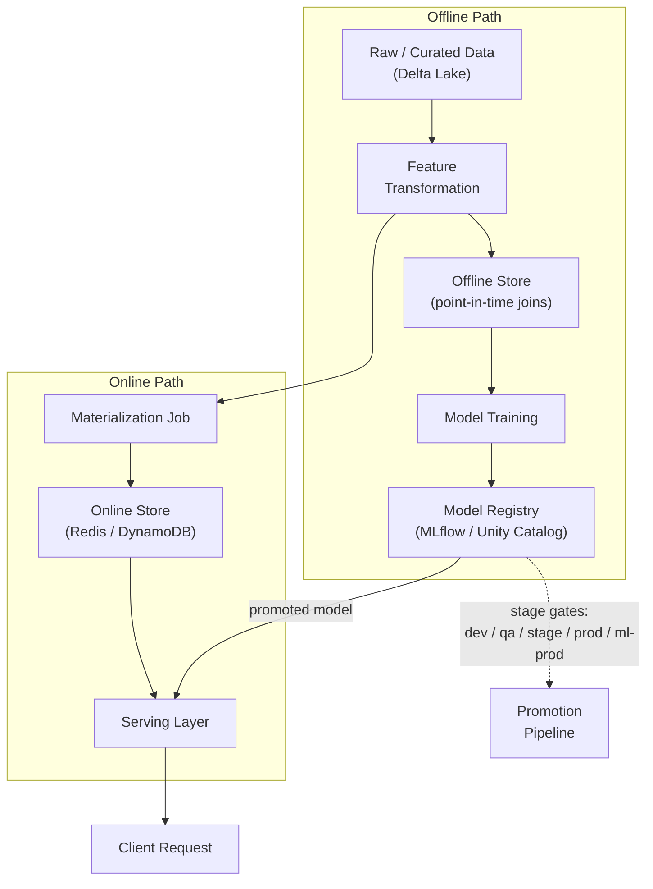

# Feature Store + Multi-Environment Model Promotion

**Weeks 5-6 of Track B.** Anchor: your GRM-style platform (dev/qa/stage/prod/ml-prod,
Unity Catalog, MLflow). Name **Feast** as the standard tool when asked "what would you use
instead of hand-rolling this."

## Core Concepts

### Why Feature Stores Exist: Training-Serving Skew

The problem a feature store solves isn't storage — it's guaranteeing that the exact same
feature computation logic produces the value used at training time *and* the value used
at serving time. When these drift apart (a classic cause: training computes a feature in a
batch Spark job, serving recomputes "the same" feature in an online service with subtly
different logic or a different data snapshot), you get **training-serving skew** — a model
that looked great offline and quietly underperforms in production, often without any
obvious error to alert on.

### Offline Store vs. Online Store

- **Offline store** (e.g. a Delta Lake / data warehouse table): holds the full historical
  feature values, used for generating training datasets via **point-in-time joins** — for
  each training label, join in feature values *as they existed at that label's timestamp*,
  not the current value. Getting this wrong (using today's feature value to train on
  yesterday's label) is called **label leakage** and silently inflates offline accuracy in
  a way that never survives contact with production.
- **Online store** (e.g. Redis/DynamoDB): holds only the *latest* feature values, optimized
  for low-latency point lookups at serving time (`get_features(entity_id)` in single-digit
  milliseconds).
- **Both stores are populated by the same feature transformation pipeline** — this shared
  definition is the actual mechanism that prevents training-serving skew; the stores are
  just two different indexes over the same logical feature values.

### Feast's Architecture (the name-drop, with substance behind it)

Feast is the standard open-source feature store because it's explicitly *not* a database —
it's a thin registry + retrieval layer over stores you already have:

- **Feature definitions** live as versioned Python objects (`FeatureView`, `Entity`) in a
  repo — this is what makes feature definitions reviewable and testable like any other
  code, and gives you a single source of truth referenced by both training and serving.
- **The registry** stores metadata (schemas, ownership, freshness SLAs), not the feature
  values themselves.
- **Materialization** is the batch/scheduled job that pushes feature values from the
  offline store into the online store, keeping serving-time lookups fast without
  recomputing on the fly.
- Feast deliberately doesn't replace Delta Lake or Redis — it sits on top of them, which is
  exactly why it's a lower-lift adoption than a fully proprietary feature-store platform.

### Environment Promotion: dev → qa → stage → prod → ml-prod

The extra `ml-prod` stage beyond a standard software promotion pipeline exists because ML
artifacts have a validation need standard code doesn't: **a model can be perfectly
"correct" code-wise and still be a bad model** (wrong metrics, drifted training data, a
regression versus the currently-deployed model on a held-out set). Promotion through each
stage should gate on a different kind of check:

| Stage | Gate |
|---|---|
| dev | Unit tests, feature pipeline runs end-to-end on sample data |
| qa | Integration tests, schema validation against the full feature store |
| stage | Full-scale shadow evaluation — score real (or replayed) traffic, compare metrics against the current prod model, no user-facing impact |
| prod (data/feature layer) | Data pipeline promoted; feature freshness SLAs monitored |
| ml-prod (model layer) | Model artifact promoted *separately* from the data pipeline — canary/shadow deployment (see [Model Serving tutorial](../04_model_serving_deployment/tutorial.md)), offline metrics **and** online metrics both meet threshold |

The key idea to state explicitly: **the model artifact and the feature/data pipeline are
promoted on separate tracks with separate gates**, because a good pipeline can still ship a
bad model, and a good model can still be broken by a bad pipeline — conflating the two
gates hides which one actually failed when something goes wrong.

### Model Registry (MLflow / Unity Catalog)

- Tracks model **versions**, their **stage** (staging/production/archived), **lineage**
  (which training run, which data version, which feature definitions produced this model),
  and **metrics** at each version.
- Unity Catalog extends this with **governance**: who can promote a model to production,
  audit trails on stage transitions, and unified access control across the feature tables
  and model artifacts together (rather than two separate permission systems to reconcile).
- The registry is what makes "roll back to the previous model version" a metadata
  operation (repoint the serving layer's alias) instead of a redeploy — always mention this
  when discussing rollback strategy.

## Reference Architecture

## Deep-Dive: Point-in-Time Joins (the trickiest part to get right)

Walk through this explicitly if it comes up — it's the single most common source of subtle
bugs in feature store design:

1. You have a table of **labels** (`entity_id`, `label`, `event_timestamp`).
2. You have a table of **feature values** (`entity_id`, `feature_value`,
   `feature_timestamp`) that changes over time — e.g. "user's 7-day purchase count."
3. A naive join (`entity_id` only) grabs whatever the *current* feature value is — this
   leaks future information into training if the feature has changed since the label was
   generated.
4. The correct join is: for each label row, find the feature row with the **latest
   `feature_timestamp` that is still ≤ the label's `event_timestamp`** — this reconstructs
   "what the feature value actually was at the moment the label was generated."
5. This is computationally more expensive (a temporal join, not a simple key join) — which
   is exactly why a purpose-built offline store implementation (rather than a hand-rolled
   SQL join every time) is worth having, and why "point-in-time correctness" is a
   headline feature when evaluating any feature store tool.

## Trade-offs

| Decision | Option A | Option B | When to pick which |
|---|---|---|---|
| Online store | Redis (in-memory, lowest latency) | DynamoDB (managed, scales without ops, slightly higher latency) | Redis when you control the ops burden and need sub-ms lookups; DynamoDB when you want managed scaling and ms-level latency is acceptable |
| Feature freshness | Real-time streaming updates to online store | Periodic batch materialization | Real-time only for features that meaningfully change within your serving latency window (e.g. "last 5 minutes of activity") — batch is sufficient and far simpler for slowly-changing features |
| Promotion gate strictness | Automated gates only (fast, consistent) | Manual sign-off required at ml-prod (slower, adds human judgment) | Manual sign-off for high-blast-radius models (pricing, fraud); automated-only for low-risk, easily-rolled-back models |
| Feature definition ownership | Centralized platform team owns all definitions | Decentralized — each ML team owns their own feature definitions | Centralized when consistency/governance matters most; decentralized when velocity matters most and teams are mature enough to self-govern |

## Failure Modes to Raise Proactively

- **Training-serving skew** from divergent online/offline feature computation logic —
  mitigated by a single shared feature definition materialized to both stores.
- **Label leakage** from naive (non-point-in-time) joins — mitigated by explicit temporal
  join logic, tested against known-good historical cases.
- **Stale online features** if the materialization job falls behind or fails silently —
  mitigated by freshness SLA monitoring and alerting on materialization lag, not just job
  success/failure.
- **A model artifact promoted without its corresponding feature definitions being in
  sync** — mitigated by versioning feature definitions alongside model versions in the
  registry's lineage metadata, so promotion can validate the pair together.

## Make It Yours

- In GRM, what actually triggered a promotion from stage to ml-prod — an automated metric
  threshold, a manual review, or both? What would you change?
- Describe a specific training-serving skew (or near-miss) you've encountered — how was it
  caught, and how long did it take to catch?
- What's the freshness SLA on your most latency-sensitive feature, and what happens when
  materialization falls behind it?

## Practice Questions

- Design a feature store supporting both real-time fraud-detection features (sub-second
  freshness) and slower-changing user-profile features (daily refresh).
- Design the promotion pipeline for a new model version from training through to
  production, including rollback.
- A model's offline evaluation metrics look great, but online performance is
  underperforming the previous version — walk through how you'd diagnose training-serving
  skew live.

---

**Previous:** [2. High-Throughput Ingestion Pipelines](../02_ingestion_pipeline/tutorial.md)  |  **Next:** [4. Model Serving & Deployment](../04_model_serving_deployment/tutorial.md)
