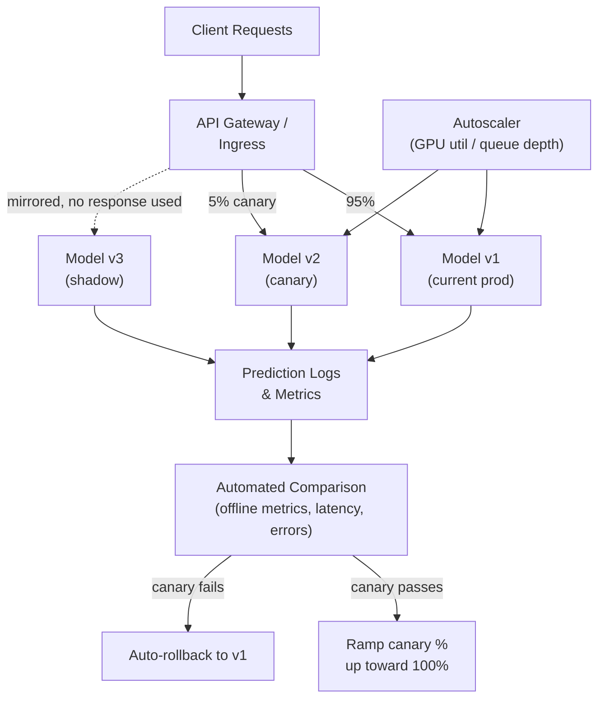

# Model Serving Layer: Canary, Shadow & Safe Rollouts

**Weeks 7-8 of Track B.** Anchor: extend GRM's XGBoost serving into a full serving-layer
design. Name **KServe/Seldon** for rollout safety and autoscaling.

## Core Concepts

### Why Model Deployment Needs Its Own Rollout Strategy

Deploying a new model version is riskier than deploying ordinary application code, because
the failure mode isn't "the server returns 500s" (which you'd catch instantly) — it's often
"the server returns 200s with subtly worse predictions," which standard health checks
don't detect at all. This is why the ML-specific rollout strategies below exist: they're
built to catch *quality* regressions, not just availability regressions.

### The Rollout Strategy Spectrum

| Strategy | How it works | Catches quality regressions? | User-facing risk |
|---|---|---|---|
| **Blue-green** | Full traffic switches from old to new version atomically | No (unless paired with pre-switch checks) | All-or-nothing — instant rollback if issues appear |
| **Canary** | New version gets a small % of *real* traffic, monitored, then ramped up | Yes — real user impact is measured, on real traffic | Limited (bounded by canary %) but non-zero — canary users do get the new model |
| **Shadow (dark launch)** | New version scores a copy of real traffic *in parallel*, its output is logged/compared but never returned to users | Yes — and with zero user-facing risk | None — this is the key advantage over canary |

**The natural sequencing in a mature pipeline:** shadow first (validate quality with zero
risk) → canary (validate under real-world serving conditions with bounded risk) → full
rollout. Stating this sequence explicitly, and *why* shadow comes before canary (de-risk
quality before exposing any real users), is a strong signal in this topic.

### KServe / Seldon: What They Actually Provide

Both are Kubernetes-native model-serving frameworks; naming *what problem they solve* (not
just the name) is what makes the name-drop land:

- **Standardized inference protocol** (V2 inference protocol) across frameworks (XGBoost,
  sklearn, PyTorch, custom) — so your serving layer, autoscaler, and monitoring don't need
  framework-specific integration for every model type.
- **Built-in canary support** — declarative traffic splitting between model versions via a
  CRD (Custom Resource Definition), instead of hand-rolling percentage-based routing logic
  in an API gateway.
- **Scale-to-zero** — genuinely idle models cost nothing between requests (via Knative
  under the hood for KServe), which matters when you're serving many low-traffic models
  rather than one high-traffic one.
- **Seldon additionally offers** first-class support for **inference graphs** — chaining a
  preprocessor → model → postprocessor (or an ensemble of models) as a single declarative
  pipeline, plus built-in explainability (Alibi) and drift detection hooks.

### Autoscaling for Model Serving

- **Standard HPA (Horizontal Pod Autoscaler)** scales on CPU/memory — usually the wrong
  metric for ML serving, since inference cost is often dominated by GPU utilization or
  request queue depth, not CPU.
- **Custom-metric autoscaling** — scale on GPU utilization, request queue depth, or p99
  latency directly (via Prometheus Adapter feeding custom metrics to HPA, or KEDA for
  event-driven scaling from queue depth). This is the detail that separates "I know
  Kubernetes autoscaling" from "I know *ML* autoscaling" in an interview.
- **Cold-start cost** is the central trade-off with scale-to-zero: a scaled-to-zero GPU
  model can take tens of seconds to a few minutes to come back up (image pull, model load
  onto GPU) — unacceptable for latency-sensitive paths. Mitigate with a minimum warm
  replica count for latency-critical models, accepting the idle cost, and reserve
  scale-to-zero for genuinely bursty/low-priority models.

## Reference Architecture

## Deep-Dive: Designing the Canary Evaluation Loop

The interesting engineering problem here isn't the traffic split — Kubernetes/KServe
handles that declaratively. It's **what automated signal decides whether to ramp up or
roll back**, since a human watching a dashboard doesn't scale and doesn't work at 3am.

1. **Define the guardrail metrics before the canary starts**, not after: a hard latency
   ceiling (e.g. p99 must not regress by more than 10%), an error-rate ceiling, and a
   business/quality metric appropriate to the model (e.g. prediction distribution
   shouldn't shift beyond a statistical threshold vs. the current prod model — this is
   where drift-detection tooling, covered in the [next tutorial](../05_observability_drift/tutorial.md),
   plugs directly into the rollout decision).
2. **Run the canary for a minimum duration and minimum sample size**, not a fixed clock
   time alone — a canary that's only seen 50 requests hasn't seen enough to statistically
   trust, regardless of how many minutes have passed.
3. **Automated ramp-up in steps** (e.g. 5% → 25% → 50% → 100%), re-checking guardrails at
   each step, rather than jumping straight from canary to full — this bounds the blast
   radius of a regression that only appears at higher traffic volumes.
4. **Automated rollback is the default on guardrail breach** — a canary that fails should
   revert without waiting for a human, given how much smaller the blast radius is if the
   system reacts in minutes rather than however long a human takes to notice.
5. **The rollback itself should be a metadata operation** (repoint traffic split back to
   100% v1), not a redeploy — this is only possible because the model registry (previous
   tutorial) keeps the previous version's artifact readily servable.

## Trade-offs

| Decision | Option A | Option B | When to pick which |
|---|---|---|---|
| Rollout strategy | Canary (real traffic, bounded risk) | Shadow (zero risk, no real user validation) | Shadow first for any model with meaningfully different behavior from prod; canary once shadow metrics look healthy |
| Serving framework | KServe (Knative-based, strong scale-to-zero) | Seldon (richer inference graphs, built-in explainability) | KServe when you need many independently-scaling single models; Seldon when you need multi-step inference pipelines or explainability out of the box |
| Autoscaling metric | CPU/memory (simple, built-in) | Custom metric — GPU util, queue depth (accurate for ML, more setup) | Custom metrics for any GPU-backed or queue-fed serving; CPU/memory is fine for lightweight CPU-only models |
| Rollback trigger | Automated on guardrail breach | Manual review required | Automated for well-understood, frequently-updated models; manual for high-stakes, infrequently-updated models where a human should be in the loop |

## Failure Modes to Raise Proactively

- **Canary evaluated on too small a sample** — statistically meaningless pass/fail signal.
  Mitigate with a minimum sample-size gate, not just a time-based one.
- **Cold-start latency spikes** on scale-to-zero models under sudden traffic — mitigate
  with a minimum warm-replica floor for latency-sensitive paths.
- **Shadow traffic silently doubling backend load** on shared downstream dependencies
  (databases, feature stores) — the "zero user-facing risk" of shadow deployment doesn't
  mean zero infrastructure risk; capacity-plan for it.
- **A canary that passes guardrails but represents a genuinely worse model on an
  under-monitored slice** (e.g. a demographic or use-case the guardrail metrics don't
  break out) — mitigate by slicing guardrail metrics on known-important segments, not just
  aggregate.

## Make It Yours

- Describe how XGBoost serving was actually rolled out in GRM — was there a canary/shadow
  step, or a direct cutover? What would adding one have caught?
- What's a specific latency or error-rate threshold you'd set as a guardrail for a model
  you've worked with, and why that number?
- Have you seen (or can you construct) an example of a model that passed aggregate
  guardrails but failed on a specific slice? How would you have caught it?

## Practice Questions

- Design the rollout process for a new fraud-detection model version, including
  guardrails and automated rollback.
- Design a serving layer that must support both a latency-critical real-time path (p99 <
  100ms) and a cost-sensitive batch-scoring path for the same model.
- Your canary's error rate looks fine but a downstream team reports the new model's
  predictions "feel off" for a specific customer segment — walk through your diagnostic
  process live.

---

**Previous:** [3. Feature Store & Model Promotion](../03_feature_store_model_promotion/tutorial.md)  |  **Next:** [5. ML/LLM Observability & Drift](../05_observability_drift/tutorial.md)
