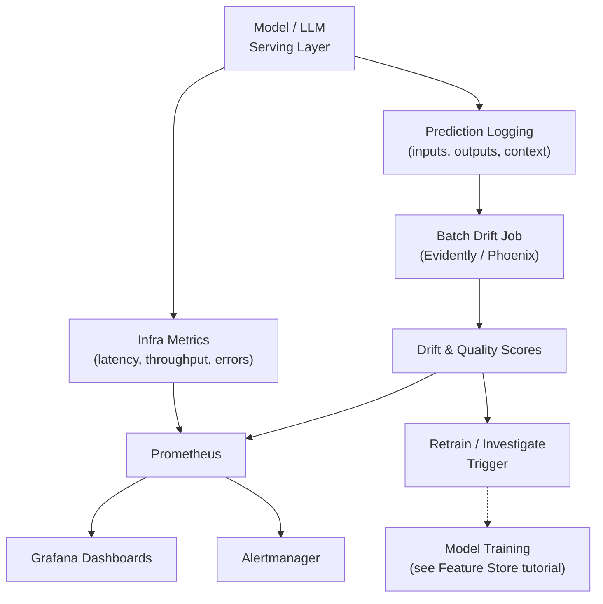

# ML/LLM Observability & Drift Detection

**Weeks 9-10 of Track B.** Anchor: generalize GRM's drift/monitoring work to many models.
Bring in **Prometheus/Grafana** for infra metrics and **Evidently or Arize Phoenix** for
drift + hallucination metrics.

## Core Concepts

### Why ML Systems Need a Different Observability Layer

Standard infra observability (is the server up, is latency acceptable, is the error rate
low) tells you the model is *running*. It tells you nothing about whether the model is
*right* — a model can serve 200s at low latency while its predictions have silently
degraded because the world it's scoring has drifted away from the world it was trained on.
This is the gap ML observability specifically fills, layered on top of standard infra
observability, not instead of it.

### The Three Kinds of Drift

| Drift type | What changes | Example | Detection approach |
|---|---|---|---|
| **Data drift (covariate shift)** | The distribution of input features changes | A recommendation model trained on pre-pandemic shopping patterns sees a shift in category popularity | Statistical distance between training and live feature distributions (PSI, KL divergence, KS test) |
| **Concept drift** | The relationship between inputs and the correct output changes | "What counts as fraud" evolves as fraudsters adapt to the current model | Monitor live model performance against delayed ground-truth labels as they arrive |
| **Prediction drift** | The distribution of the model's *outputs* changes | The model starts predicting a much higher rate of one class than during training | Statistical distance between training-time and live prediction distributions — the cheapest of the three to monitor, since it needs no ground truth |

**Prediction drift is the one to monitor first and continuously** — it requires no
ground-truth labels (which are often delayed by days/weeks in real systems), and a shift
here is often the earliest signal that data or concept drift is happening upstream, before
you have the labels to confirm it directly.

### Evidently / Arize Phoenix: What They Actually Compute

Naming these tools with the underlying statistics behind them is what separates a
name-drop from a real answer:

- **Population Stability Index (PSI)** — buckets a feature's values into bins, compares
  the % of the population in each bin between a reference (training) window and a current
  window. A common rule of thumb: PSI < 0.1 is stable, 0.1-0.25 is moderate drift worth
  watching, > 0.25 is significant drift worth acting on.
- **KL divergence / KS test** — more statistically rigorous distribution-comparison
  methods for continuous features, used when PSI's binning is too coarse.
- **Evidently** generates these comparisons as reports/dashboards you can run in a batch
  pipeline (e.g. nightly, comparing yesterday's live feature distribution against the
  training baseline) — it's a library, not a hosted service, which matters for the
  build-vs-buy trade-off in an interview.
- **Arize Phoenix** additionally targets **LLM-specific** observability: embedding-based
  drift detection (comparing embedding distributions rather than raw feature values, which
  is necessary once your "features" are unstructured text/images), and tracing individual
  LLM calls (prompt, retrieved context, response) for debugging.

### LLM-Specific Observability Signals

Beyond classical drift, LLM-serving systems need their own additional signals:

- **Token throughput** (tokens/sec) — the actual unit of "capacity" for an LLM-serving
  system, more meaningful than requests/sec since request cost varies enormously with
  prompt/response length.
- **Time-to-first-token (TTFT) vs. total latency** — for streaming responses, users
  perceive TTFT as "responsiveness" even if total generation takes much longer; measuring
  only end-to-end latency hides a real UX signal.
- **Hallucination / faithfulness metrics** — for RAG systems specifically, whether the
  generated response is actually supported by the retrieved context (measurable via
  LLM-as-judge scoring, or embedding-similarity between response claims and retrieved
  passages) — this is the LLM-era equivalent of "is the prediction correct," and it's a
  much harder problem than classical drift because there's rarely a simple ground-truth
  label available at serving time.
- **Cost per request** — token-based pricing means cost isn't a fixed infra line item
  anymore, it's a per-request metric worth tracking and alerting on, especially after a
  prompt-template change.

### Prometheus + Grafana: The Infra Layer Underneath All of This

- **Prometheus** scrapes/collects time-series metrics (latency histograms, request counts,
  queue depth, GPU utilization) and evaluates alerting rules against them.
- **Grafana** visualizes those metrics and (this is the detail worth stating) can also
  visualize custom ML metrics (drift scores, hallucination rates) pushed into Prometheus as
  gauges — so your ML-quality dashboards and your infra dashboards live in the same pane of
  glass rather than two disconnected tools.
- The trade-off worth naming: Prometheus/Grafana are excellent for *numeric time-series*
  (a drift score over time) but not built for *tracing individual bad predictions back to
  their inputs* — that's what a tool like Arize Phoenix or a custom prediction-logging
  pipeline is for. Stating this division of labor explicitly shows you understand why a
  real system needs both, not one or the other.

## Reference Architecture

## Deep-Dive: Designing the Drift-to-Retrain Feedback Loop

This is the component that turns "we have dashboards" into "we have a self-correcting
system" — a strong deep-dive target.

1. **Prediction and input logging happens at serving time**, sampled if full logging is
   too expensive at scale (e.g. log 100% of a low-traffic model, 1% of a high-traffic one,
   with guaranteed logging of any prediction flagged low-confidence).
2. **A scheduled batch job** (nightly, or triggered by data volume) computes drift scores
   (PSI/KL for features, embedding drift for unstructured inputs, prediction-distribution
   drift for outputs) comparing the recent window against the training baseline.
3. **Drift scores are pushed as metrics into the same Prometheus/Grafana stack** as infra
   metrics — this is what lets you set a Prometheus alerting rule ("PSI > 0.25 for 3
   consecutive days") using the exact same alerting infrastructure as a latency SLO, rather
   than a separate bespoke system.
4. **Alert routing distinguishes severity**: moderate drift routes to a Slack channel for
   human investigation; severe drift (or a confirmed ground-truth performance drop, once
   labels arrive) can auto-trigger a retraining pipeline run — but auto-triggered
   *retraining* should still require human approval before *promotion* (tying back to the
   promotion gates in the [Feature Store tutorial](../03_feature_store_model_promotion/tutorial.md)),
   since a retrained model isn't automatically a better one.
5. **Close the loop with a runbook**, not just an alert: what should the on-call engineer
   actually check first when a drift alert fires (which features, which segments, whether
   it correlates with a known upstream data source change)?

## Trade-offs

| Decision | Option A | Option B | When to pick which |
|---|---|---|---|
| Logging volume | Log 100% of predictions | Sample (e.g. 1-10%) | Sample once volume makes full logging cost-prohibitive; always log 100% of low-confidence or flagged predictions regardless |
| Drift detection cadence | Real-time/streaming drift scoring | Scheduled batch job (nightly) | Batch is sufficient for most drift types (they develop over days/weeks, not seconds) — reserve real-time for known-fast-moving domains like fraud |
| Alert action | Auto-trigger retraining pipeline | Alert a human, retraining is manual | Auto-trigger for well-understood, frequently-retrained models with strong offline validation; manual for high-stakes or infrequently-updated models |
| LLM quality measurement | LLM-as-judge scoring (flexible, costs additional LLM calls) | Embedding-similarity heuristics (cheaper, less nuanced) | LLM-as-judge for high-stakes or nuanced quality questions; embedding heuristics for cheap, continuous, first-pass monitoring at volume |

## Failure Modes to Raise Proactively

- **Alert fatigue from over-sensitive drift thresholds** — mitigated by requiring
  sustained drift over a window (not a single reading) before alerting, and by
  differentiating severity tiers.
- **Label delay masking concept drift** — ground-truth labels for concept drift often
  arrive days/weeks late (e.g. "was this transaction actually fraud" confirmed after a
  chargeback); prediction-drift monitoring is the early-warning system that doesn't wait
  for labels.
- **Drift detected on an unimportant feature while an important one goes unmonitored** —
  mitigate by weighting/prioritizing drift monitoring on features with the highest
  documented importance to the model, not treating every feature equally.
- **Hallucination undetected because there's no ground truth to compare against** — this
  is the hardest failure mode in this whole topic; mitigate with faithfulness scoring
  against retrieved context (for RAG) rather than trying to verify "truth" in the abstract.

## Make It Yours

- What did GRM's drift/monitoring work actually check, and what would generalizing it to
  "many models" require changing (per-model thresholds? a shared dashboard? per-model
  runbooks)?
- Describe a specific alert threshold you've set (or would set) and the reasoning behind
  the specific number, not just "we monitor drift."
- If you extended your Track C project with hallucination detection, what would the
  simplest viable version look like — and what would it miss?

## Practice Questions

- Design a monitoring system for 50 models in production, each with different traffic
  volumes and different drift sensitivities.
- Design the alerting and escalation path from "drift detected" to "model retrained and
  promoted," including where human review sits in that path.
- A RAG system's users report the answers "feel less accurate" over the past week, but
  no infra metric has changed — walk through how you'd investigate live.

---

**Previous:** [4. Model Serving & Deployment](../04_model_serving_deployment/tutorial.md)  |  **Next:** [6. RAG + LLM-Serving at Scale](../06_rag_llm_serving_at_scale/tutorial.md)
