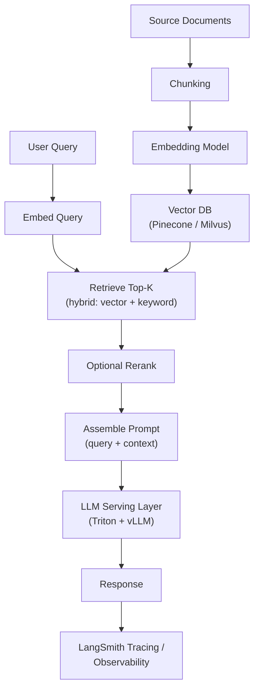

# RAG Retrieval + LLM-Serving at Scale

**Weeks 11-12 of Track B.** Anchor: this is your Track C project — describe the real
vector DB, LangChain, and serving-layer choices you made and their trade-offs. This
tutorial is the conceptual backing for that hands-on build.

## Core Concepts

### Why RAG Exists

An LLM's parametric knowledge is frozen at training time and can't cite sources. RAG
(Retrieval-Augmented Generation) fixes both problems by retrieving relevant documents at
query time and injecting them into the prompt as context, so the model generates from
*current, attributable, domain-specific* information instead of (or in addition to) what
it memorized during training. The core trade-off it introduces: retrieval quality now
caps generation quality — a perfect LLM fed the wrong context still gives a wrong answer.
This is why the tutorial below spends as much time on retrieval as on generation.

### Chunking Strategy

Documents must be split into retrievable units before embedding, and the split strategy is
a bigger lever on RAG quality than most teams initially expect.

- **Fixed-size chunking** (e.g. 512 tokens with overlap) — simplest, but can split a
  coherent idea across chunk boundaries, losing context on either side.
- **Semantic/structural chunking** — split on natural boundaries (paragraphs, sections,
  markdown headers) — preserves coherent units better, at the cost of variable chunk sizes
  that complicate batching.
- **Overlap between chunks** (e.g. 10-20% overlap) mitigates boundary-splitting by
  duplicating a bit of context at each edge — a cheap mitigation worth naming explicitly.
- **Chunk size is a direct latency/quality trade-off**: smaller chunks retrieve more
  precisely but need more of them to cover a topic (more tokens in the prompt, higher
  latency/cost); larger chunks reduce retrieval count but dilute relevance per chunk.

### Embedding & Vector Search

- **Embedding model choice** trades off quality, latency, and dimensionality (higher
  dimensions = better quality generally, but more storage and slower search) — and
  critically, **the same embedding model must be used for indexing and querying**;
  switching models requires re-embedding the entire corpus, not just new queries.
- **Approximate Nearest Neighbor (ANN) search** — exact nearest-neighbor search doesn't
  scale past a small corpus; production vector DBs use ANN algorithms (HNSW is the most
  common) that trade a small amount of recall for orders-of-magnitude faster search.
- **Hybrid search** (combining dense vector similarity with sparse keyword search like
  BM25) often outperforms pure vector search alone — vector search excels at semantic
  similarity but can miss exact-match signals (a product SKU, an error code) that keyword
  search catches trivially. Naming hybrid search as the production-grade default, not pure
  vector search, is a strong signal here.

### Vector DB Choice (Pinecone vs. Milvus)

| | Pinecone | Milvus |
|---|---|---|
| Model | Fully managed SaaS | Open-source, self-hosted (or managed via Zilliz) |
| Ops burden | None — you don't manage infra | You own scaling, upgrades, backups (or pay Zilliz to) |
| Cost model | Usage-based, can get expensive at scale | Infra cost only — cheaper at high scale if you have the ops capacity |
| Best fit | Fast to ship, small team, don't want to run infra | Cost-sensitive at scale, already running Kubernetes, need more control over indexing algorithms |

State this as a genuine build-vs-buy trade-off, not "Pinecone is better" — the right answer
depends on team size and ops maturity, which is exactly the kind of judgment senior
interviews are probing for.

### LangChain / LangGraph Orchestration

- **LangChain** provides the plumbing: document loaders, text splitters, embedding-model
  wrappers, vector-store integrations, and prompt templates — its value is standardizing
  these interfaces so swapping a vector DB or embedding model is a config change, not a
  rewrite.
- **LangGraph** extends this to **stateful, multi-step agent workflows** (e.g. retrieve →
  grade relevance → re-retrieve if insufficient → generate → self-critique) modeled as an
  explicit graph — the natural evolution when a single retrieve-then-generate call isn't
  enough (this is often called **agentic RAG**, and it's worth naming as the "what's
  beyond basic RAG" answer if asked).
- **LangSmith** (the observability counterpart) traces these multi-step chains for
  debugging — directly analogous to the tracing capability described in the
  [previous tutorial](../05_observability_drift/tutorial.md), specialized for chain/agent
  workflows.

## Reference Architecture

## Deep-Dive: LLM Serving Internals (vLLM on Triton)

This is the most technically differentiating deep-dive available in this whole plan —
most candidates can describe RAG at a high level; fewer can explain *why* vLLM is fast.

- **The problem classical serving has:** naive LLM serving allocates a fixed, contiguous
  block of GPU memory for each request's KV cache (the attention mechanism's per-token
  memory), sized for the *maximum possible* sequence length. Since most requests are
  shorter than the max, this wastes enormous amounts of GPU memory — directly limiting how
  many concurrent requests fit on a GPU.
- **PagedAttention (vLLM's core innovation)** borrows the OS concept of virtual memory
  paging: the KV cache is split into fixed-size blocks allocated on demand, non-contiguous
  in memory, tracked via a block table per request — like how an OS doesn't require a
  process's memory to be contiguous. This eliminates most of the wasted memory, directly
  translating into more concurrent requests per GPU.
- **Continuous batching** (as opposed to static batching): instead of waiting for a full
  batch of requests to arrive and finish together (where one long request holds up the
  whole batch), new requests join the running batch as soon as GPU capacity frees up
  (i.e., as soon as any request in the batch finishes generating). This is what actually
  drives high GPU utilization under real, bursty, variable-length traffic.
- **Triton's role**: it's the serving *framework* around the inference engine — handling
  the OpenAI-compatible API frontend, request queuing/scheduling, multi-model/multi-LoRA
  serving (multiple fine-tuned adapters sharing one base model's weights in memory,
  dramatically reducing memory cost versus serving each fine-tune as a separate full
  model), and metrics export — while vLLM is the specific *backend* doing the
  memory-efficient inference execution itself.

## Trade-offs

| Decision | Option A | Option B | When to pick which |
|---|---|---|---|
| Retrieval method | Pure vector (dense) search | Hybrid (dense + sparse/BM25) | Hybrid almost always wins in production once exact-match terms (IDs, codes, names) matter to your domain |
| Chunk size | Small chunks (precise, more of them) | Large chunks (fewer, more context each) | Small for fact-lookup queries; large for queries needing broader context/summarization |
| Serving backend | vLLM (highest throughput, continuous batching) | HuggingFace TGI / plain Transformers (simpler, lower throughput) | vLLM once you need production-grade concurrency; plain Transformers fine for low-traffic prototypes |
| Multi-tenant serving | One full model per fine-tune | Multi-LoRA (shared base weights, swappable adapters) | Multi-LoRA whenever you have several fine-tunes of the same base model — the memory savings are substantial |
| Agent complexity | Single retrieve-then-generate call | Multi-step agentic RAG (LangGraph) | Single-call for well-scoped Q&A; agentic when queries need iterative refinement, tool use, or self-correction |

## Failure Modes to Raise Proactively

- **Retrieval returning irrelevant context that the LLM then confidently builds an answer
  around** — this is often worse than retrieving nothing, since the response *looks*
  well-grounded. Mitigate with a relevance/reranking step, and a "no confident answer"
  fallback path when top-retrieved relevance scores are below threshold.
- **GPU memory fragmentation / OOM under bursty long-context traffic** — mitigated by
  PagedAttention's block-based allocation, but still worth monitoring KV-cache utilization
  as a first-class metric, not just GPU memory percentage.
- **Embedding model / vector index drift** — if source documents update frequently and
  re-indexing lags, retrieval serves stale context; needs the same freshness-SLA thinking
  as the feature store tutorial.
- **Cost runaway from unbounded context length** — a single very long retrieved-context
  prompt can dominate cost and latency; mitigate with a hard cap on retrieved-context
  tokens and prioritizing the highest-relevance chunks within that budget.

## Make It Yours

- In your Track C project, why did you pick the vector DB you picked — was it a genuine
  trade-off decision or a default? Be ready to defend it either way, honestly.
- What did your load test (Locust/k6) actually reveal about throughput vs. latency at
  different concurrency levels — what was the surprising part?
- If asked "what would you change at 10x traffic," what's your honest answer for this
  specific project — more GPU replicas, a different serving backend, a caching layer in
  front of common queries?

## Practice Questions

- Design a RAG system for internal company documentation supporting 1,000 concurrent
  users, including how you'd keep the index fresh as documents change daily.
- Design the serving layer for three different fine-tuned versions of the same base model,
  optimizing for GPU cost.
- A RAG system's retrieval looks correct in testing but users report irrelevant answers in
  production — walk through your live debugging process, including what you'd check first.

---

**Previous:** [5. ML/LLM Observability & Drift](../05_observability_drift/tutorial.md)  |  **Next:** [7. Distributed Training & Ray/Ray Serve](../07_distributed_training_serving/tutorial.md)
