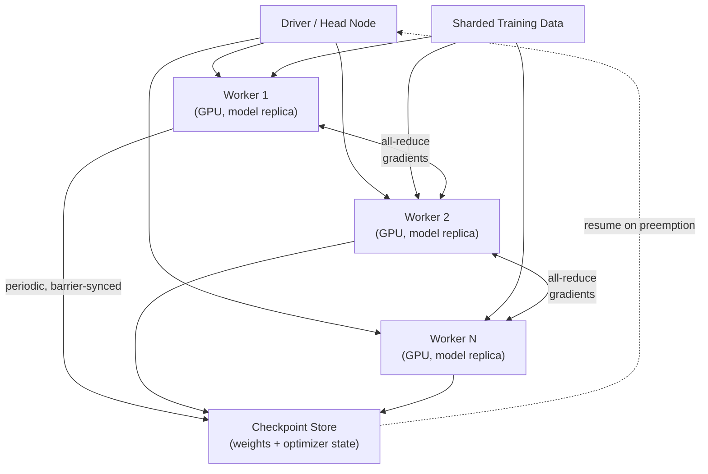

# Distributed Training & Ray/Ray Serve

**Extends Track B.** Covers the Track D "strong differentiator" tool Ray/Ray Serve, and
the distributed-training concepts underneath any conversation about training at scale —
relevant whenever a single GPU (or single machine) can't hold the model or the data.

## Core Concepts

### Why Distributed Training Is Its Own Problem, Not Just "More Machines"

A single GPU training job is trivially correct: one copy of the model, one data stream,
one set of gradients. The moment you split work across multiple GPUs or machines, you
introduce a new correctness concern — **keeping every replica's view of the model
consistent** — and a new performance concern — **the communication cost of synchronizing
that view can dominate the compute cost it's supposed to speed up.** Every distributed
training strategy below is a different answer to "what do we split, and how do we
resynchronize it."

### The Three Parallelism Strategies

| Strategy | What's split | When you need it | The bottleneck it introduces |
|---|---|---|---|
| **Data parallelism** | The training *data* — each worker holds a full model copy, processes a different data shard | The model fits on one GPU, but training on the full dataset in reasonable time doesn't | Gradient synchronization (all-reduce) across workers after every step |
| **Model parallelism** | The *model* itself — different layers/parts live on different GPUs | The model doesn't fit in one GPU's memory at all | Sequential dependency between GPUs — one waits idle while another computes (pipeline bubbles) |
| **Pipeline parallelism** | The model, split into stages, with *multiple micro-batches in flight* across stages simultaneously | Model parallelism's idle-GPU problem needs mitigating at larger scale | Bubble overhead still exists at the start/end of each batch, just amortized better |

**The question that reveals which one a design needs**: *"Does the model fit on a single
GPU?"* If yes, you almost certainly want data parallelism first (simplest, most mature
tooling). If no, you need some form of model/pipeline parallelism, usually combined with
data parallelism across groups of GPUs (this combination is what "3D parallelism" in
large-model training literature refers to).

### Gradient Synchronization: Sync vs. Async

- **Synchronous (all-reduce)**: every worker waits for every other worker to finish its
  step, gradients are averaged, then all workers update together. Deterministic, matches
  single-GPU training math exactly, but throughput is capped by the *slowest* worker
  (straggler problem).
- **Asynchronous (parameter server)**: workers push gradients and pull updated weights
  without waiting for each other. Higher throughput, no straggler bottleneck, but
  introduces **stale gradients** (a worker computes against weights that have since moved)
  — this can hurt convergence and makes training less reproducible, which is why
  synchronous all-reduce (via NCCL/Horovod-style ring-allreduce) is the more common
  default in modern large-scale training despite the straggler cost.

### Checkpointing at Scale

- **Why it's harder than "save the model"**: at scale, checkpointing must capture
  optimizer state (not just weights — Adam-style optimizers carry per-parameter momentum
  state that's often *larger* than the model itself), and it must do so **consistently
  across every worker** without stalling training for too long.
- **The failure mode to name explicitly**: a checkpoint taken while workers are at
  slightly different steps (a partial/inconsistent checkpoint) can silently resume training
  from a corrupted state — correct checkpointing barriers all workers at the same step
  before writing.
- **Spot/preemptible instances** make this a first-class design concern, not an edge case:
  training on interruptible capacity requires frequent, cheap, consistent checkpoints and
  an automated resume-from-latest-checkpoint restart path — this is the single biggest
  reason large training runs on spot capacity need more checkpointing engineering than
  runs on guaranteed capacity.

### Ray: What It Actually Provides

- **Ray Core**: a general distributed-execution framework — remote functions (`@ray.remote`)
  and actors (stateful remote objects) that abstract away manual process/socket management
  for distributed Python. This is the primitive everything else in the Ray ecosystem is
  built on.
- **Ray Train**: wraps the data/model-parallelism patterns above into a higher-level API,
  handling worker orchestration and gradient synchronization so you don't hand-roll it.
- **Ray Serve**: a model-serving layer built on Ray Core — its distinguishing feature
  versus Triton/KServe is **native Python-first composition of arbitrary serving logic**
  (chaining models, business logic, and calls to other services in plain Python, scaled
  as Ray actors) rather than requiring a declarative inference-graph config. Trade-off:
  more flexibility, less standardization than KServe's protocol-first approach.
- **The object store**: Ray's shared-memory store for passing large objects (arrays,
  model weights) between tasks without expensive serialization/copying — when it fills
  up, Ray **spills** objects to disk automatically, which is a performance cliff worth
  knowing about and monitoring (object-store memory pressure is a common, non-obvious
  cause of a Ray cluster mysteriously slowing down).

## Reference Architecture: Distributed Training Job

## Deep-Dive: Diagnosing Poor Scaling Efficiency

A near-universal follow-up in this topic: *"you added more GPUs and throughput barely
improved — why?"* Walk through the diagnostic order:

1. **Check if it's actually compute-bound.** Profile GPU utilization per worker — if it's
   consistently high (>90%) and throughput still doesn't scale, the bottleneck is
   elsewhere (network, data loading), not compute.
2. **Check the communication-to-computation ratio.** As you add more workers, the
   all-reduce step's cost grows while each worker's compute-per-step shrinks (data shard
   gets smaller) — past a certain worker count, communication overhead dominates. This is
   why scaling efficiency is sublinear past some point for any fixed model/batch size, and
   why larger batch sizes (more compute per communication round) improve scaling
   efficiency, up to the point where larger batches start hurting convergence.
3. **Check network topology.** Cross-node all-reduce over a slower network fabric is
   dramatically more expensive than intra-node GPU-to-GPU communication (NVLink) — if
   workers are spread across nodes with standard networking instead of a
   high-bandwidth interconnect, that's often the entire answer.
4. **Check data loading.** A data pipeline that can't feed GPUs fast enough starves them
   regardless of compute capacity — profile whether GPUs are actually idle waiting on the
   next batch.
5. **Check for stragglers.** One slow worker (bad hardware, noisy-neighbor contention)
   caps synchronous training's throughput at its speed — worth explicitly monitoring
   per-worker step time variance, not just the average.

## Trade-offs

| Decision | Option A | Option B | When to pick which |
|---|---|---|---|
| Parallelism strategy | Data parallelism | Model/pipeline parallelism | Data parallelism whenever the model fits on one GPU; model parallelism only when it genuinely doesn't |
| Gradient sync | Synchronous all-reduce | Asynchronous parameter server | Synchronous for reproducibility and modern tooling support; async only when straggler mitigation matters more than determinism |
| Serving framework | Ray Serve (flexible Python composition) | KServe/Triton (standardized protocol, strong scale-to-zero) | Ray Serve for complex multi-step Python serving logic; KServe/Triton for standardized single/multi-model serving at scale |
| Training capacity | On-demand instances (reliable, expensive) | Spot/preemptible (cheap, requires robust checkpointing) | Spot whenever the checkpointing/resume engineering is in place — the cost savings are usually substantial |

## Failure Modes to Raise Proactively

- **Inconsistent checkpoints from unbarriered workers** — mitigated by synchronized
  checkpoint barriers across all workers.
- **Object store memory pressure causing silent disk-spill slowdowns in Ray** — mitigated
  by monitoring object-store utilization as a first-class cluster metric.
- **Straggler workers capping synchronous training throughput** — mitigated by per-worker
  step-time monitoring and, at scale, techniques like backup workers or gradient
  compression.
- **Stale-gradient convergence issues in async training** — mitigated by staleness bounds
  (rejecting/down-weighting gradients computed against too-old weights) if async is chosen
  at all.

## Make It Yours

- Have you run (or would you expect to run) a distributed training job — what actually
  capped its scaling efficiency?
- Describe a checkpoint/resume failure (or near-miss) you've seen — what would robust
  barriered checkpointing have changed?
- Would Ray Serve or KServe fit better for a serving layer you've built — argue both sides
  honestly.

## Practice Questions

- Design the training infrastructure for a model too large to fit on a single GPU.
- Your distributed training job's throughput plateaus at 4 GPUs and gets worse beyond
  that — diagnose it live.
- Design a checkpointing strategy for a multi-day training run on spot instances that can
  be preempted with only a 2-minute warning.

---

**Previous:** [6. RAG + LLM-Serving at Scale](../06_rag_llm_serving_at_scale/tutorial.md)  |  **Next:** [8. ML Orchestration: Kubeflow/Argo Workflows vs Airflow](../08_ml_orchestration/tutorial.md)
