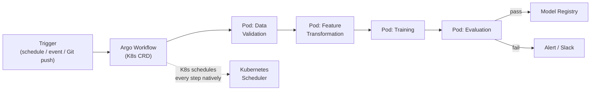

# ML Orchestration: Kubeflow/Argo Workflows vs Airflow

**Extends Track B.** Covers the Track D "strong differentiator": naming Kubeflow or Argo
Workflows as the K8s-native alternative to Airflow, with the actual architectural
reasoning behind when each wins.

## Core Concepts

### What an Orchestrator Actually Owns

An orchestrator's job is narrow but critical: given a DAG of tasks with dependencies,
decide *when* each task runs, *where* it runs, *retry it* on failure, and give you
observability into the whole thing. It doesn't do the work itself — it schedules and
supervises. Every comparison below is really about *where* that scheduling decision lives
and what execution model it assumes.

### Airflow's Model: A Python-Defined DAG, Executed Elsewhere

- DAGs are defined as Python code (`@task` decorators or the classic operator API) —
  this is Airflow's biggest adoption advantage: any Python-fluent team can write a DAG
  immediately, no new DSL to learn.
- Airflow's **scheduler** is a separate, persistent service that must itself be
  highly-available — it's not Kubernetes-native by default, meaning you're running and
  operating a piece of infrastructure *outside* your K8s cluster (or awkwardly inside it)
  to coordinate work that often *targets* your K8s cluster.
- Task execution can happen via various "executors" (Celery, Kubernetes Executor, etc.) —
  the Kubernetes Executor narrows this gap by launching each task as its own pod, but the
  scheduler itself remains a separate operational concern.

### Argo Workflows' Model: The DAG *Is* a Kubernetes Resource

- A workflow is defined as a Kubernetes Custom Resource (CRD) — every step is natively a
  pod, scheduled by Kubernetes itself, not by a separate scheduler service you have to run.
  This is the core architectural difference: **Argo has no separate scheduler to operate**
  — the thing already running your infrastructure (Kubernetes) is the thing running your
  DAG.
- This makes Argo Workflows a natural fit when your pipeline steps are already
  containerized and your team already lives in Kubernetes/GitOps tooling (it composes
  directly with ArgoCD — see the [next tutorial](../09_gitops_ml_cicd/tutorial.md)).
- The trade-off: YAML/CRD-based DAG definition is less ergonomic for data scientists than
  Airflow's plain Python, and the ecosystem of pre-built operators/integrations is smaller.

### Kubeflow Pipelines: ML-Specific Orchestration on Top of Argo

- Kubeflow Pipelines is built **on top of** Argo Workflows, adding ML-specific concerns:
  each pipeline step is a containerized component with typed inputs/outputs, pipeline
  runs are versioned and comparable (critical for experiment tracking — "which pipeline
  version produced this model"), and it integrates with Kubeflow's broader ecosystem
  (hyperparameter tuning via Katib, distributed training operators).
- **The naming distinction that matters in an interview**: Argo Workflows is a *general*
  Kubernetes-native DAG engine; Kubeflow Pipelines is *specifically* an ML-pipeline
  abstraction built using Argo as its execution engine underneath. Knowing this layering
  (not just that both exist) is what separates a real answer from a name-drop.

### The Actual Decision Framework

| Factor | Favors Airflow | Favors Kubeflow/Argo Workflows |
|---|---|---|
| Team's primary language for pipeline authoring | Python-fluent, wants to write plain Python | Comfortable with YAML/K8s-native config, or using Kubeflow SDK |
| Where pipeline steps execute | Mixed — some non-K8s targets (a SQL warehouse job, a SaaS API call) | Everything is already a container running in K8s |
| Existing GitOps maturity | Less K8s-centric infra overall | Already using ArgoCD/GitOps for deployments — natural extension |
| ML-specific pipeline versioning needs | Handled via separate tooling (MLflow, custom) | Built-in via Kubeflow Pipelines' typed component versioning |
| Ecosystem/integrations needed | Large existing operator ecosystem (many SaaS/cloud integrations) | Smaller but sufficient for container-native workloads |

**The framework answer to give out loud**: *"If the team is already living in Kubernetes
and GitOps, and pipeline steps are containerized ML work, Kubeflow/Argo removes an entire
separate scheduler service to operate. If pipelines need to orchestrate a mix of
non-Kubernetes systems (SaaS APIs, external data warehouses) with a Python-fluent team,
Airflow's broader ecosystem and language ergonomics usually win."* This is a genuine
build-vs-buy-style trade-off, not a strictly-better-or-worse comparison.

## Reference Architecture: Argo-Native ML Pipeline

## Deep-Dive: Migrating an Airflow DAG to Argo Workflows (a common "how would you" question)

1. **Inventory what each Airflow task actually does.** Tasks that already run inside a
   container (via the Kubernetes Executor or a `DockerOperator`) map almost directly to
   an Argo `Template` — this is usually most of a modern Airflow DAG.
2. **Identify non-containerized tasks** (tasks calling a Python library directly on the
   scheduler host, or hitting a SaaS API without containerization) — these need to be
   containerized first, since Argo has no equivalent to "run this Python function inline
   on the scheduler."
3. **Translate dependency structure.** Airflow's `>>` operator dependency chains map
   directly to Argo's `dependencies` field in its DAG template — this part is usually
   mechanical.
4. **Replace Airflow-specific features deliberately, not by accident**: Airflow's
   sensors (poll until a condition is true), SLA misses, and dynamic task mapping each
   have an Argo equivalent, but they're not 1:1 — this is where a naive migration
   silently drops functionality if not checked explicitly.
5. **Decide what happens to scheduling itself** — Argo Workflows needs a trigger
   (`CronWorkflow` for schedule-based, or an external event source) since it doesn't have
   Airflow's always-on scheduler polling loop by default.

## Trade-offs

| Decision | Option A | Option B | When to pick which |
|---|---|---|---|
| Orchestrator | Airflow | Argo Workflows / Kubeflow Pipelines | Airflow for mixed K8s/non-K8s targets and Python-first teams; Argo/Kubeflow when everything is already containerized in K8s |
| Pipeline definition | Imperative Python DAG | Declarative YAML/CRD | Python for iteration speed and data-scientist ergonomics; declarative CRDs for GitOps-native, auditable, diffable pipeline definitions |
| ML-specific features | Hand-roll versioning/lineage via MLflow alongside Airflow | Kubeflow Pipelines' built-in typed, versioned components | Built-in when starting fresh in a K8s-native ML platform; hand-rolled when Airflow is already deeply embedded and full migration isn't justified |

## Failure Modes to Raise Proactively

- **Migrating an Airflow DAG and silently losing sensor/SLA functionality** — mitigated by
  an explicit feature-parity checklist before migration, not an assume-it-just-works port.
- **Argo Workflows without a proper trigger mechanism** — a workflow with no `CronWorkflow`
  or event source configured simply never runs; this is a common first-deployment gap.
- **Running Airflow's scheduler as a single point of failure** — mitigated by
  highly-available scheduler configuration, which is itself extra operational burden Argo
  avoids by design.

## Make It Yours

- If you've used Airflow, what specific feature (sensors, SLAs, dynamic task mapping)
  would be hardest to give up moving to Argo?
- Is your team's existing infra K8s-native enough that Argo Workflows would be a net
  simplification, or would it add complexity? Be honest about the actual answer.

## Practice Questions

- Design the orchestration layer for a nightly ML pipeline that must run across both a
  Kubernetes cluster and a managed data warehouse.
- Walk through migrating a specific Airflow DAG (pick one you know) to Argo Workflows,
  step by step.
- Design a pipeline orchestration system with strict lineage/versioning requirements — an
  auditor needs to reconstruct exactly which pipeline version produced any historical
  model.

---

**Previous:** [7. Distributed Training & Ray/Ray Serve](../07_distributed_training_serving/tutorial.md)  |  **Next:** [9. GitOps & CI/CD for ML](../09_gitops_ml_cicd/tutorial.md)
