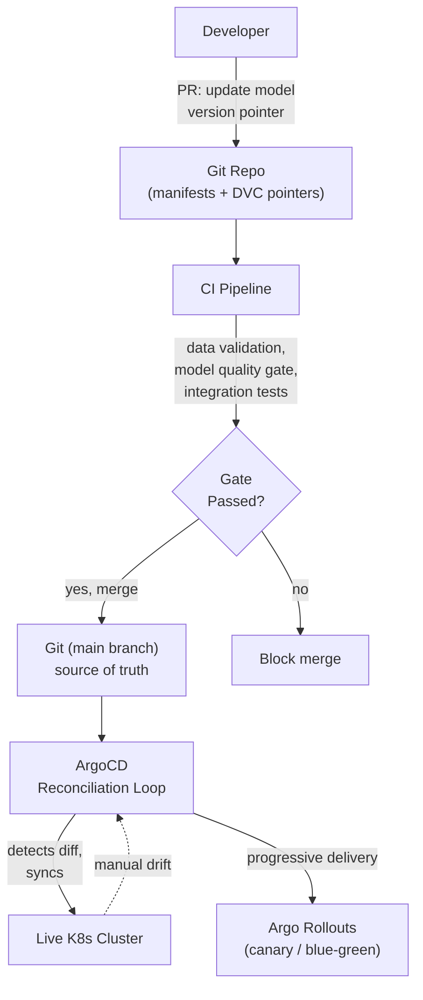

# GitOps & CI/CD for ML (ArgoCD + DVC)

**Extends Track B.** Covers two more Track D "strong differentiator" tools: ArgoCD for
GitOps-based rollout, and DVC as the general-purpose equivalent of Delta Lake/Unity
Catalog for data versioning.

## Core Concepts

### GitOps: Git as the Single Source of Truth for Desired State

The core idea, stated precisely: **the live state of your infrastructure/deployments
should always be a reconciled copy of what's declared in a Git repository** — not
whatever's left over from the last person who ran a manual `kubectl apply` or clicked
through a console. A controller continuously compares live state against the Git-declared
state and corrects drift automatically.

- **Why this matters for ML specifically**: model deployments have historically been
  imperative and manual ("SSH in, update the model file, restart the service") — exactly
  the failure-prone pattern GitOps eliminates. Applying GitOps to model rollout means "promote
  a model to production" *is* "merge a PR that updates a version pointer in Git," which is
  auditable, reviewable, and revertible using tools every engineer already knows (`git
  revert`).
- **This directly composes with the promotion pipeline** from the
  [feature store tutorial](../03_feature_store_model_promotion/tutorial.md): the model
  registry decides *which* version is ready for prod; GitOps is the mechanism that
  actually *makes it so* in the live cluster, declaratively.

### ArgoCD's Reconciliation Loop

- ArgoCD watches a Git repo (containing Kubernetes manifests or Helm/Kustomize configs)
  and continuously diffs it against the live cluster state.
- **Sync** applies the Git-declared state to the cluster. **Drift detection** flags (and
  can auto-correct) any live-cluster change that doesn't match Git — this is what actually
  prevents "someone manually patched prod and nobody remembers why" from becoming a
  permanent, undocumented divergence.
- **Progressive delivery** (via Argo Rollouts, a companion project): declarative
  canary/blue-green rollout *strategies* as Kubernetes resources — this is the GitOps-native
  implementation of the canary rollout concepts from the
  [model serving tutorial](../04_model_serving_deployment/tutorial.md). Instead of a
  custom canary-evaluation script, the rollout strategy (traffic percentages, analysis
  steps, automatic rollback conditions) is itself declared in Git and executed by a
  controller.

> **Want to actually run this?** See [Hands-On: ArgoCD](argocd_hands_on.md) — installing
> ArgoCD, creating an Application, watching drift detection correct a manual change, and
> configuring an Argo Rollouts canary with automated Prometheus-based guardrails.

### DVC vs. Delta Lake/Unity Catalog: The Actual Difference

Both solve "version control for data," but for different environments:

| | DVC | Delta Lake / Unity Catalog |
|---|---|---|
| Model | Git-like versioning for files/directories, backed by cloud storage (S3/GCS) | Table-format versioning built into a data lakehouse, with ACID transactions |
| Best fit | Smaller teams, file-based datasets (images, small-to-medium tables), lighter infra | Large-scale structured data already living in a lakehouse, needing transactional guarantees |
| Git integration | Native — a `.dvc` file (a pointer to the actual data) lives *in* your Git repo alongside code | Separate system — versioning lives in the table format itself, referenced from code, not embedded in Git |
| Governance | Minimal built-in — access control is whatever the underlying storage provides | Strong built-in governance (Unity Catalog: fine-grained access control, audit logs, lineage) |

**The name-drop with substance**: DVC is the right answer when someone asks "what would
you use for data versioning outside a full lakehouse platform" — its Git-native workflow
(data version pointers committed alongside code) is what makes it attractive for smaller
teams or file-heavy datasets (images, audio) that don't naturally fit a table format.

> **Want to actually run this?** See [Hands-On: DVC](dvc_hands_on.md) — tracking a
> dataset, pushing it to an S3 remote, versioning data across Git commits, and building a
> reproducible `dvc.yaml` pipeline.

### CI/CD Testing Strategy Specific to ML

Standard CI (unit tests, linting) isn't sufficient for ML pipelines — add these ML-specific
gates:

- **Data validation tests**: schema checks, null/range checks on incoming data — catches
  upstream data issues before they reach training (ties to the
  [ingestion pipeline tutorial](../02_ingestion_pipeline/tutorial.md)'s schema evolution
  discussion).
- **Model quality gates**: a new model version must beat a minimum threshold (or not
  regress beyond a tolerance) against a fixed evaluation set, *before* it's eligible for
  promotion — this is a CI gate, not just a manual check, and it's what makes "model
  passed CI" mean something concrete.
- **Pipeline integration tests**: run the full pipeline end-to-end on a small synthetic
  dataset as part of CI — catches breakage from a dependency upgrade or a refactor before
  it hits a multi-hour production pipeline run.
- **Reproducibility checks**: given the same data version and code version, does retraining
  produce a model within expected variance? A pipeline that can't reproduce its own
  results is a governance and debugging liability, worth testing for explicitly.

## Reference Architecture

## Deep-Dive: Designing the Model-Promotion GitOps Flow

The most interview-relevant deep-dive in this topic — it ties the model registry, CI
gates, and ArgoCD together into one coherent promotion story.

1. **The model registry (MLflow/Unity Catalog) is the ML-specific source of truth** for
   "which model version has passed evaluation" — this is a separate concern from
   Kubernetes deployment state.
2. **Promotion is triggered by a PR**, not a manual deploy: a PR updates a config value
   (e.g. a Helm values file or Kustomize overlay) referencing the new model version/image
   tag. This PR is where the CI quality gates above run.
3. **Merging the PR is the only path to changing production** — this is the actual
   GitOps discipline: nobody `kubectl apply`s a model update directly; the only way
   production changes is a reviewed, merged Git change.
4. **ArgoCD picks up the merge and syncs**, deploying the new version according to
   whatever Argo Rollouts strategy is declared (canary percentages, analysis steps tied
   to the guardrail metrics from the serving tutorial).
5. **A failed canary triggers an automatic rollback** — critically, this rollback is
   *also* a Git-state change (or an ArgoCD-managed exception to it), keeping the audit
   trail intact even during an automated revert, rather than silently patching the live
   cluster out-of-band.

## Trade-offs

| Decision | Option A | Option B | When to pick which |
|---|---|---|---|
| Deployment mechanism | Push-based CI/CD (CI pipeline directly applies changes) | Pull-based GitOps (ArgoCD reconciles from Git) | GitOps whenever drift-prevention and audit trail matter — the near-universal modern default for Kubernetes-based ML serving |
| Data versioning | DVC (Git-native, file-based) | Delta Lake / Unity Catalog (lakehouse-native, transactional) | DVC for smaller/file-based datasets without a full lakehouse; Delta/Unity Catalog when already on that platform at scale |
| Rollout strategy declaration | Custom scripts/pipeline steps | Argo Rollouts (declarative, Git-versioned) | Argo Rollouts once already GitOps-native — keeps rollout strategy itself under version control and review |

## Failure Modes to Raise Proactively

- **Manual cluster changes silently drifting from Git** — mitigated by ArgoCD's
  continuous drift detection and (optionally) auto-correction.
- **A model quality gate that's too lenient to catch a real regression** — mitigated by
  setting the gate against a fixed, representative evaluation set, revisited periodically
  as production data evolves.
- **DVC data pointers in Git going stale** (the underlying storage object gets deleted or
  moved outside DVC's tracking) — mitigated by treating the data store behind DVC with the
  same retention/immutability discipline as the Git repo itself.
- **A rollback that bypasses Git**, restoring service but breaking the audit trail —
  mitigated by ensuring even emergency rollbacks flow through the same GitOps mechanism,
  or are explicitly reconciled back into Git immediately after.

## Make It Yours

- Was your GRM promotion pipeline push-based or pull-based (GitOps)? What would changing
  that actually buy you?
- Describe a specific "someone manually changed prod" incident (or near-miss) you've seen
  — how would ArgoCD's drift detection have caught it?
- What data-versioning approach does your current stack actually use, and where would DVC
  fit (or not fit) into it?

## Practice Questions

- Design a GitOps-based promotion pipeline for ML models, from PR merge to production
  canary to full rollout.
- Compare designing a data-versioning strategy with DVC vs. Delta Lake for a team
  migrating off ad-hoc S3-bucket versioning.
- A production model was updated without a corresponding Git commit — walk through how
  you'd detect this happened and prevent recurrence.

---

**Previous:** [8. ML Orchestration: Kubeflow/Argo Workflows vs Airflow](../08_ml_orchestration/tutorial.md)  |  **Next:** [10. Cost, Security & Multi-Region Governance](../10_cost_security_multiregion/tutorial.md)
