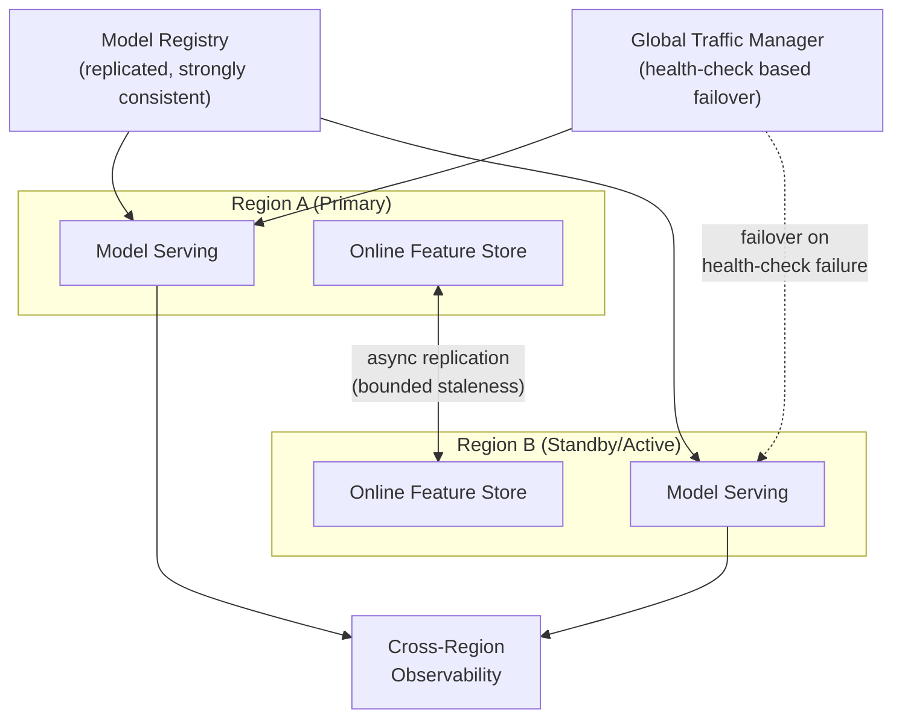

# Cost, Security & Multi-Region Governance

**Extends Track B.** These three concerns rarely get their own interview question in
isolation, but show up as **follow-ups** to almost every design in this section ("what
does this cost at scale," "how do you handle PII here," "what happens if this region goes
down") — senior candidates are expected to raise them unprompted, not just answer when
asked.

## Core Concepts

### Cost: Where ML Systems Actually Spend Money

- **Training cost** scales with compute-hours × instance cost — the main lever is spot/
  preemptible capacity (see the [distributed training tutorial](../07_distributed_training_serving/tutorial.md)'s
  checkpointing discussion for what that requires).
- **Serving cost** scales differently depending on architecture: classical model serving
  cost is roughly proportional to request volume; **LLM serving cost is proportional to
  tokens processed**, not requests — a single long-context request can cost as much as
  hundreds of short ones. This is why token-based cost monitoring (from the
  [observability tutorial](../05_observability_drift/tutorial.md)) is a cost concern, not
  just a quality one.
- **Idle GPU cost** is often the single largest avoidable spend in ML infra — a GPU
  provisioned for peak load but sitting at 20% utilization most of the day is pure waste.
  Mitigations: autoscaling tied to actual load (from the
  [model serving tutorial](../04_model_serving_deployment/tutorial.md)), multi-LoRA
  serving to share base-model weights across fine-tunes, and scale-to-zero for genuinely
  bursty workloads.
- **Multi-tenancy cost allocation**: when multiple teams/models share infrastructure,
  **cost attribution** (which team's traffic caused this GPU-hour) becomes its own
  design problem — usually solved via request-level tagging/labeling that flows through
  to billing/cost-reporting tools, not an afterthought bolted on later.

### Security & Compliance in ML Pipelines

- **PII handling** is a data-pipeline design concern from day one, not a bolt-on: PII
  fields need explicit tagging at ingestion (tying to the
  [ingestion pipeline tutorial](../02_ingestion_pipeline/tutorial.md)'s schema
  discussion), access-controlled at the feature-store layer (Unity Catalog's
  fine-grained access control is the direct tool here), and excluded or anonymized before
  reaching training data unless explicitly authorized and logged.
- **Model governance / audit trail**: "which model version served this specific
  prediction, trained on which data version, approved by whom" needs to be
  reconstructable after the fact — this is the lineage concern from the
  [feature store tutorial](../03_feature_store_model_promotion/tutorial.md)'s registry
  discussion, extended to a compliance requirement rather than just an engineering
  convenience.
- **LLM-specific security concerns**: prompt injection (malicious input manipulating the
  model's behavior via the prompt itself, especially dangerous in RAG systems where
  retrieved context could contain injected instructions), and data leakage through model
  outputs (a fine-tuned or RAG-augmented model inadvertently surfacing sensitive training/
  retrieval data in its responses) — both worth naming explicitly for any LLM-serving
  design, since they're genuinely different from classical model security concerns.
- **Access control granularity**: who can promote a model to production, who can view
  which features (especially PII-derived ones), who can trigger a retrain — these should
  map to the same environment-promotion gates from the
  [feature store tutorial](../03_feature_store_model_promotion/tutorial.md), not a
  separate, disconnected permission system.

### Multi-Region & Disaster Recovery

- **The core trade-off is the same CAP-theorem axis from the
  [fundamentals tutorial](../01_fundamentals/tutorial.md)**, applied to ML infrastructure
  specifically: can the model registry / feature store tolerate being briefly
  inconsistent across regions during a failover, or does it need strong consistency at
  the cost of availability during a partition?
- **RTO (Recovery Time Objective)** and **RPO (Recovery Point Objective)** are the two
  numbers that actually define a DR design — state them explicitly rather than designing
  "for high availability" vaguely: RTO is *how long* you can be down, RPO is *how much
  data/state* you can afford to lose. A serving layer might need an RTO of minutes; a
  training data warehouse might tolerate an RPO of hours.
- **Active-active vs. active-passive**: active-active (multiple regions serving live
  traffic simultaneously) gives the best RTO (near-zero failover time) but requires
  solving cross-region data consistency continuously, not just during failover —
  active-passive (a standby region, promoted on failure) is simpler to reason about but
  has a real failover time (RTO) while the standby spins up and DNS/traffic cuts over.
- **The failure mode worth raising unprompted**: a DR plan that's never been tested is not
  a DR plan — the actual failover time under a real incident is often far worse than the
  designed RTO, because replication lag, DNS propagation delay, and stateful component
  warm-up (cold caches, cold model-serving replicas) are easy to underestimate on paper.

## Reference Architecture: Multi-Region ML Serving

## Deep-Dive: Designing Cost Attribution for a Shared ML Platform

A concrete, interview-friendly deep-dive that combines cost and multi-tenancy:

1. **Every request is tagged at ingress** with the requesting team/model identity
   (a header or auth-token claim), propagated through the entire serving path — this is
   the single design decision everything else depends on; retrofitting tagging after the
   fact is far more painful than building it in from the start.
2. **Metrics (from the [observability tutorial](../05_observability_drift/tutorial.md))
   are labeled with that tenant identity** — Prometheus labels are the natural mechanism,
   letting cost-relevant metrics (GPU-seconds, tokens processed) be queried per-tenant
   without a separate tracking system.
3. **A scheduled job aggregates tagged usage into a cost report**, joining against actual
   infra billing data (cloud cost-explorer exports) to convert "GPU-seconds used" into
   "dollars attributable to team X."
4. **Shared infrastructure costs** (a shared base model serving multiple LoRA adapters, a
   shared vector DB) need an explicit allocation policy (even split, proportional to
   request volume, etc.) — state the policy explicitly rather than leaving it undefined,
   since "who pays for the shared GPU" is exactly the kind of ambiguity that causes
   organizational friction later.
5. **Alerting on cost anomalies** (a specific tenant's spend spikes unexpectedly) uses the
   same alerting infrastructure as the drift/quality alerts from the observability
   tutorial — cost is just another metric worth monitoring with the same rigor.

## Trade-offs

| Decision | Option A | Option B | When to pick which |
|---|---|---|---|
| Multi-region strategy | Active-passive (simpler, real failover time) | Active-active (near-zero RTO, continuous consistency complexity) | Active-passive when RTO of minutes is acceptable and ops simplicity matters; active-active only when near-zero downtime is a genuine hard requirement worth the consistency engineering |
| PII handling | Filter/anonymize at ingestion | Store raw, restrict access at query time | Filter-at-ingestion when PII is never needed downstream; restrict-at-access when legitimate use cases need raw access under strict governance |
| Cost allocation granularity | Coarse (per-team monthly estimate) | Fine-grained (per-request tagged, real-time) | Fine-grained once shared infrastructure costs become large enough that mis-allocation causes real organizational friction |

## Failure Modes to Raise Proactively

- **An untested DR failover** that takes far longer than the designed RTO under a real
  incident — mitigated by regular, scheduled failover drills, not just a written runbook.
- **PII leaking into training data** because it wasn't tagged/filtered at ingestion —
  mitigated by schema-level PII tagging as a required field, not an optional convention.
- **Prompt injection in a RAG system** via malicious content in retrieved documents —
  mitigated by treating retrieved context as untrusted input, with output filtering/
  guardrails rather than assuming retrieved content is safe by construction.
- **Cost attribution gaps for shared infrastructure** causing disputes or unexpected bills
  — mitigated by an explicit, agreed-upon allocation policy stated before the shared
  infrastructure is built, not after the first surprising invoice.

## Make It Yours

- What's your organization's actual RTO/RPO for the ML systems you've worked on — stated
  as numbers, not "we want it to be reliable"? Has failover ever actually been tested?
- Describe how PII was (or wasn't) handled in a pipeline you've built — what would you
  change knowing what you know now?
- If GRM served multiple teams' models, how would you have attributed GPU cost between
  them?

## Practice Questions

- Design a disaster-recovery strategy for a real-time model-serving system with a target
  RTO of 5 minutes and RPO of 1 minute.
- Design a cost-attribution system for a shared LLM-serving platform used by 10 internal
  teams.
- A compliance auditor asks you to prove no PII was used to train a specific model version
  — walk through what your system would need to answer that.

---

**Previous:** [9. GitOps & CI/CD for ML](../09_gitops_ml_cicd/tutorial.md)  |  **Next:** [Tricky MLOps Scenarios](../11_tricky_scenarios/README.md)
